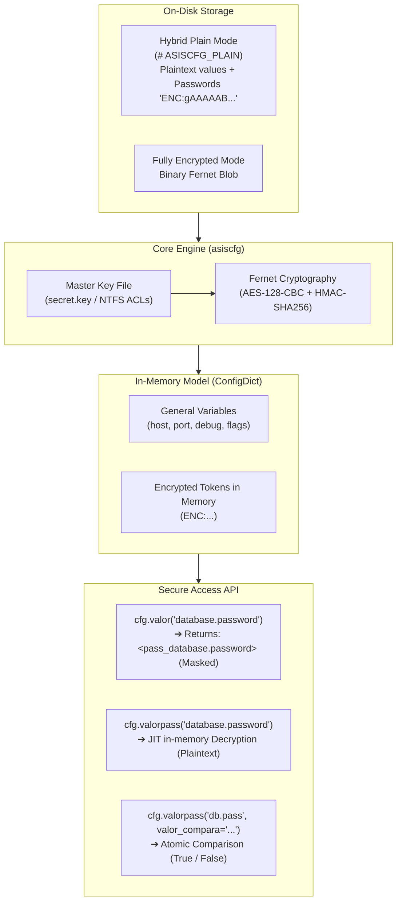

[🇪🇸 Español](README.md) | [🇺🇸 English](README.en.md)

---

# pkg-asiscfg

Modular Python library and graphical viewer/editor (GUI) for centralized management, strict schema validation, and secure encryption of configuration files.

[](LICENSE)
[](https://www.python.org/downloads/)
[](https://cryptography.io/)

---

## 📋 Table of Contents

- [Key Features](#-key-features)
- [Security Model and Cryptographic Architecture](#-security-model-and-cryptographic-architecture)
  - [1. Standard Robust Cryptography (Fernet / AES-128-CBC + HMAC-SHA256)](#1-standard-robust-cryptography-fernet--aes-128-cbc--hmac-sha256)
  - [2. Hybrid Plain vs Fully Encrypted Storage Model](#2-hybrid-plain-vs-fully-encrypted-storage-model)
  - [3. Principle of Minimal Exposure (Lazy / Just-In-Time Decryption)](#3-principle-of-minimal-exposure-lazy--just-in-time-decryption)
  - [4. Secure In-Memory Password Comparison (Safe Match)](#4-secure-in-memory-password-comparison-safe-match)
  - [5. Plaintext Password Detection and Automated Sanitation](#5-plaintext-password-detection-and-automated-sanitation)
  - [6. Access Control, Hashing and UAC Elevation](#6-access-control-hashing-and-uac-elevation)
  - [7. Immutable Operations Audit](#7-immutable-operations-audit)
- [Project Architecture](#-project-architecture)
- [Prerequisites](#-prerequisites)
- [Installation and Setup](#-installation-and-setup)
- [Usage Modes](#-usage-modes)
  - [1. Graphical User Interface (GUI)](#1-graphical-user-interface-gui)
  - [2. Modular Python Library Usage](#2-modular-python-library-usage)
  - [3. CLI and Available Options](#3-cli-and-available-options)
- [Data Access API (`ConfigDict`)](#-data-access-api-configdict)
  - [Access Methods Summary](#access-methods-summary)
  - [Hierarchical Cascading Inheritance (`valor_parent` / `valorpass_parent`)](#hierarchical-cascading-inheritance-valor_parent--valorpass_parent)
  - [Profile Management (`get_profiles`, `get_profile_config`)](#profile-management-get_profiles-get_profile_config)
- [Schema Definition (`config_schema.py`)](#-schema-definition-config_schemapy)
  - [Standard Schema and Field Metadata](#standard-schema-and-field-metadata)
  - [Multi-Profile Template (`_template`)](#multi-profile-template-_template)
  - [Connection Test Buttons (`test_connection`)](#connection-test-buttons-test_connection)
  - [Automated Backup Policy (`_backup`)](#automated-backup-policy-_backup)
- [Standalone Executable Build (PyInstaller)](#-standalone-executable-build-pyinstaller)
  - [64-bit Build](#64-bit-build)
  - [32-bit Build (Windows 7 / x86)](#32-bit-build-windows-7--x86)
- [Critical Security and Operational Considerations](#-critical-security-and-operational-considerations)
- [Frequently Asked Questions & Troubleshooting](#-frequently-asked-questions--troubleshooting)
- [Authorship and Credits](#-authorship-and-credits)
- [License](#-license)

---

## 🚀 Key Features

- **Flexible Storage Formats:**
  - **Hybrid Plain Mode (`format_mode="plain"`, default):** Saves configuration in human-readable, indented JSON with header `# ASISCFG_PLAIN`, encrypting with Fernet **only sensitive fields** (`"is_password": True`) using format `"password": "ENC:gAAAAAB..."`. Allows inspecting and editing general parameters (ports, hosts, IPs, flags) with any text editor (Notepad, VS Code).
  - **Fully Encrypted Mode (`format_mode="encrypted"`):** Encrypts the entire file into a single binary block with Fernet (AES-128-CBC + HMAC-SHA256).
  - **Smart Format Autodetection:** `load_config()` detects the format automatically and transparently by inspecting file header signatures or Fernet binary payloads without requiring extra parameters.
  - **Arbitrary Filenames & Extensions:** Supports any extension (`config.enc`, `config.json`, `config.cfg`, etc.).
- **Secure Data Access Model (`ConfigDict`):**
  - **Password Masking:** `valor()` and `valor_profile()` return a protective mask `<pass_section.key>` preventing accidental credential leakage in logs or stack traces.
  - **Just-In-Time (JIT) Decryption:** `valorpass()` and `valorpass_profile()` decrypt credentials in memory only at the exact millisecond of invocation.
  - **Atomic In-Memory Comparison:** `valorpass(..., valor_compara="pass")` safely compares passwords atomically returning a boolean (`True`/`False`), avoiding plaintext variable retention.
  - **Hierarchical Cascading Inheritance:** `valor_parent()` and `valorpass_parent()` resolve values with priority: Profile (`@profiles.<id>.<sec>.<key>`) ➔ Global (`<sec>.<key>`) ➔ Schema default.
- **Modern Graphical User Interface (CustomTkinter):**
  - **Origin Read Indicator:** Displays in header whether active file was opened as `📄 Read origin: Plain Text (Editable)` or `🔒 Read origin: Fully Encrypted`.
  - **Dedicated Save Actions:** Two separate save buttons: `📄 Save Editable` (plain mode) and `🔒 Save Encrypted` (fully encrypted mode).
  - **Strict Visual Validation:** Real-time validation of numerical types, ranges (`min`/`max`), enums, and required fields before saving.
  - **Integrated Connection Testing (`test_connection`):** Configurable schema buttons to test database connectivity (SQL Server, PostgreSQL, MySQL, SQLite, FoxPro/DBF) delegating to `pkg-asisdb`.
  - **Multi-Profile Management:** Create, clone, rename, delete, and customize company profiles based on `_template`.
  - **Built-in Viewers:** Modal viewers for JSON configuration snapshot and interactive schema structure.
- **Security & Access Control:**
  - Administrative login protected by SHA-256 hash (`admin_pass_hash`).
  - Windows UAC Administrator verification for production system modification, with a `--dev` development bypass flag.
  - Traceable audit trail saved to `audit.log`.

---

## 🛡️ Security Model and Cryptographic Architecture

`pkg-asiscfg` is engineered following rigorous industry standards to ensure confidentiality, integrity, and non-repudiation for mission-critical configuration settings.



### 1. Standard Robust Cryptography (Fernet / AES-128-CBC + HMAC-SHA256)
- Uses the **Fernet** standard specification implemented by Python `cryptography`.
- **Confidentiality:** Symmetric **AES encryption with 128-bit key in CBC mode** with PKCS7 padding.
- **Integrity & Authenticity:** Cryptographic signature via **HMAC with SHA-256** calculated over the initialization vector (IV) and ciphertext. Any tampering or bit alteration results in immediate decryption failure.
- **Unique IV Generation:** Every encryption call generates a random 128-bit IV and a 64-bit timestamp, ensuring identical passwords yield completely distinct ciphertext tokens.

### 2. Hybrid Plain vs Fully Encrypted Storage Model
| Dimension | Hybrid Plain Mode (`format_mode="plain"`) | Fully Encrypted Mode (`format_mode="encrypted"`) |
| :--- | :--- | :--- |
| **File Header** | `# ASISCFG_PLAIN` | Binary Fernet envelope |
| **General Variables** | Human-readable indented JSON | Encrypted binary block |
| **Sensitive Fields** | Individually encrypted (`"password": "ENC:..."`) | Encrypted inside binary block |
| **External Editing** | Modify IPs, ports, flags via Notepad/VS Code | Requires `asiscfg` GUI or Python library |
| **Key Security** | **Identical (Fernet)** for all passwords | **Identical (Fernet)** for entire file |

### 3. Principle of Minimal Exposure (Lazy / Just-In-Time Decryption)
To prevent accidental exposure in stack traces, memory dumps, or log files:
- When loading configuration into memory with `load_config()`, fields with `"is_password": True` are **not decrypted en masse**; they are held in memory as encrypted tokens (`ENC:...`).
- If code invokes `cfg.valor("database.password")` or prints `print(cfg.valor(...))`, the library **never exposes the password** and returns `<pass_database.password>`.
- Decryption happens **exclusively on demand (Just-In-Time)** when calling `cfg.valorpass()` or `cfg.valorpass_profile()`.

### 4. Secure In-Memory Password Comparison (Safe Match)
When checking whether user input matches a stored credential, there is no need to assign decrypted plaintext to intermediate variables:
```python
# Atomic verification without keeping plaintext in memory:
is_valid = config.valorpass("database.password", valor_compara=user_input)
# Returns True if matches, False otherwise
```

### 5. Plaintext Password Detection and Automated Sanitation
- If an operator manually edits the JSON configuration and enters plaintext in a password field (omitting `ENC:`):
  - In production mode, `asiscfg` detects the security anomaly.
  - In GUI mode (`edit_mode=True`), `cfg.get_unencrypted_passwords()` flags the exposed keys and prompts a warning modal (`PlaintextPasswordsWarningDialog`), automatically encrypting them with Fernet upon saving.

### 6. Access Control, Hashing and UAC Elevation
- **Admin Password:** GUI configuration tool access is guarded by a unidirectional **SHA-256 cryptographic hash** in `@asiscfg.admin_pass_hash` (`hash_password()`).
- **Windows UAC Verification:** Prevents unauthorized local users from changing system service configs via `is_admin()`. The `--dev` flag bypasses elevation for development/testing.

### 7. Immutable Operations Audit
- Critical operations (GUI opening, login attempts, admin password updates, and save events) are logged with ISO timestamps in `audit.log`.

---

## 🏗 Project Architecture

```text
pkg-asiscfg/
├── asiscfg/                  # Modular Python package (pkg-asiscfg)
│   ├── __init__.py               # Public API facade and exports
│   ├── constants.py              # System constants, defaults, and version signatures
│   ├── core.py                   # Loading, saving, hybrid encryption, backup, and schemas
│   ├── crypto.py                 # Cryptographic engines & strategy registry
│   ├── models.py                 # ConfigDict model, valor/valorpass, and cascading resolution
│   ├── schema.py                 # Type validation, range bounds, and schema metadata
│   ├── security.py               # SHA-256 hashing, UAC elevation check, and audit logs
│   ├── resources/                # Package resources (i18n catalogs, logo.ico)
│   └── ui/                       # Visual layer (CustomTkinter)
│       ├── app.py                # Main window, dynamic profile tabs, UI validation
│       ├── dialogs.py            # Modals (login, password reset, companies, JSON viewer)
│       └── utils.py              # Colors, palettes, themes, and icons
├── resources/                    # Root distribution assets
├── tests/                        # Automated unit test suite
│   ├── test_config_package.py    # Schema tests, hybrid encryption, multi-company profiles
│   ├── test_connection_mapping.py# Connection mapping and wildcard interpolation
│   └── test_ui_profile_validation.py # UI validation and password integrity tests
├── build_exe.py / .ps1           # PyInstaller 64-bit build scripts
├── build32.bat                   # PyInstaller 32-bit build script (Win7 / x86)
├── pyproject.toml                # Package metadata (name = "pkg-asiscfg")
├── requirements.txt              # Standard development dependencies
├── requi32.txt                   # Fixed dependencies for Win32 environments
└── README.md                     # Spanish technical documentation
```

---

## 📦 Prerequisites

- **Python:** Version `3.8` or newer (32-bit or 64-bit).
- **Operating System:** Windows 7 / 8 / 10 / 11 / Windows Server (or Linux for headless core usage).
- **Sister Packages:**
  - `pkg-i18n` (Internationalization and localization)
  - `pkg-asisdb` (Database connectivity and testing)

---

## ⚙️ Installation and Setup

### 1. Clone and Create Virtual Environment

```powershell
# Navigate to project directory
cd "pkg-asiscfg"

# Create virtual environment
python -m venv .venv

# Activate virtual environment
.\.venv\Scripts\Activate.ps1
```

### 2. Install Dependencies

```powershell
pip install -r requirements.txt
pip install -e .
```

---

## 🖥 Usage Modes

### 1. Graphical User Interface (GUI)

To open the configuration GUI in development mode:

```powershell
python asiscfg.py --schema-file "..\PATH_TO_SCHEMA\config_schema.py" --config-file "..\PATH_TO_CONFIG\config.cfg" --key-file "..\PATH_TO_KEY\config.key" --dev --app
```

#### GUI Authentication Flow:
1. When opening a new or uninitialized file, the default master password is: `admin`.
2. In production mode (without `--dev`), the tool requires **Administrator** privileges (Windows UAC elevation).
3. **Read Origin Header:** The top bar informs whether the file loaded in plain editable or fully encrypted mode.
4. **Saving:** Offers `📄 Save Editable` (hybrid plain) and `🔒 Save Encrypted` (total encryption).

---

### 2. Modular Python Library Usage

```python
from asiscfg import load_config, save_config

# 1. Load configuration (autodetects plain or encrypted format)
config = load_config(
    config_path="config.cfg",
    key_path="config.key"
)

# Inspect detected origin format ('plain' or 'encrypted')
print("Detected format:", config.format_mode)

# 2. Access general non-sensitive parameters
app_name = config.valor("app.name", default="My App")
db_host = config.valor("database.host", default="127.0.0.1")
db_port = config.valor("database.port", default=1433)

# 3. Access passwords (JIT Decryption)
# NOTE: config.valor("database.password") returns "<pass_database.password>"
db_pass = config.valorpass("database.password")

# 4. In-memory comparison without plaintext leakage
is_match = config.valorpass("database.password", valor_compara="secret123")

# 5. Access multi-company profile settings (@profiles)
active_profile = "01"
emp_name = config.valor_profile(active_profile, "info.name")
emp_pass = config.valorpass_profile(active_profile, "database.password")

# 6. Cascading inheritance: Profile -> Global -> Default
eff_host = config.valor_parent("database.host", profile_code=active_profile)
eff_pass = config.valorpass_parent("database.password", profile_code=active_profile)

# 7. Modify values and save
config["database"]["host"] = "192.168.1.50"

# Save in editable plain text mode with encrypted sensitive keys (default):
save_config("config.cfg", "config.key", dict(config), format_mode="plain")

# Or save in fully encrypted binary mode:
save_config("config.cfg", "config.key", dict(config), format_mode="encrypted")
```

---

### 3. CLI and Available Options

The CLI entrypoint `python asiscfg.py` supports the following arguments:

| Option | Type | Description |
| :--- | :--- | :--- |
| `--config-file` | `Path` | Path to configuration file (default: `config.enc`, supports `.json`, `.cfg`, etc.). |
| `--key-file` | `Path` | Path to Fernet master key file (default: `secret.key`). |
| `--schema-file` | `Path` | Path to schema definition file `.py` exporting `DEFAULT_CONFIG`. |
| `--format-mode` | `String` | Target save mode: `'plain'` (default) or `'encrypted'`. |
| `--theme` | `String` | Visual appearance mode: `'dark'` (default), `'light'`, or `'system'`. |
| `--dev` | `Flag` | **Development mode:** Bypasses mandatory UAC Administrator checks. |
| `--app` | `Flag` | Allows editing parameters inside the `app` section in the GUI. |
| `--reset-admin-pass` | `Flag` | Resets admin password back to `'admin'` directly from CLI without opening GUI. |
| `--export-schema` | `Flag` | Exports base schema template `config_schema.py` to target path. |
| `--i18n-path` | `Path` | Custom external translation catalogs path for host application. |

---

## 📊 Data Access API (`ConfigDict`)

The `ConfigDict` class extends `dict` with specialized security and inheritance methods:

### Access Methods Summary

| Method | Field Type | Behavior |
| :--- | :--- | :--- |
| `valor(key_path, default=None)` | Non-Password | Returns raw value. |
| `valor(key_path, default=None)` | Password (`is_password: True`) | Returns security mask `<pass_{key_path}>`. |
| `valorpass(key_path, default="", valor_compara=None)` | Password (`is_password: True`) | If `valor_compara` is `None`, decrypts JIT and returns plaintext. If provided, returns boolean match (`True`/`False`). |
| `valorpass(key_path, default="", valor_compara=None)` | Non-Password | Returns variable mask `<var_{key_path}>`. |
| `valor_profile(profile, key_path, default=None)` | Non-Password / Password | Same behavior as `valor()`, scoped to `@profiles.<profile>`. |
| `valorpass_profile(profile, key_path, ...)` | Non-Password / Password | Same behavior as `valorpass()`, scoped to `@profiles.<profile>`. |
| `valor_parent(key_path, profile="", default="", key_path_parent="")` | Non-Password / Password | Resolves hierarchically: Profile ➔ Global ➔ Default. Masks passwords. |
| `valorpass_parent(key_path, profile="", default="", key_path_parent="", ...)` | Non-Password / Password | Resolves hierarchically and decrypts JIT password fields. |

### Profile Management
- `cfg.get_profiles()`: Returns list of profile codes under `@profiles` (e.g. `["01", "02"]`).
- `cfg.has_profiles()`: Returns `True` if active configuration has profiles.
- `cfg.get_profile_config(profile_code)`: Returns full profile dictionary.
- `cfg.get_unencrypted_passwords()`: Returns list of `(key, value)` tuples of unencrypted password fields detected on load.

---

## 📝 Schema Definition (`config_schema.py`)

### Standard Schema and Field Metadata

```python
DEFAULT_CONFIG = {
    "app": {
        "name": {"default": "ASISNET CONFIGURATOR", "type": "str", "description": "t18n#Application Name"},
        "version": {"default": "1.0.0", "type": "str", "description": "t18n#System Version"}
    },
    "database": {
        "engine": {
            "default": "mssql",
            "type": "enum",
            "options": ["mssql", "postgresql", "mysql", "sqlite", "foxpro"],
            "description": "t18n#Database Engine"
        },
        "host": {"default": "127.0.0.1", "type": "str", "description": "t18n#Server or Host"},
        "port": {"default": 1433, "type": "int", "min": 1, "max": 65535, "description": "t18n#TCP Port"},
        "user": {"default": "sa", "type": "str", "description": "t18n#DB Username"},
        "password": {"default": "", "type": "str", "is_password": True, "description": "t18n#DB Password"}
    }
}
```

> [!TIP]
> **Internationalization with `t18n#` prefix:**
> Prefacing descriptions with `t18n#` (e.g. `"description": "t18n#Application Name"`) automatically invokes `pkg-i18n` for dynamic multi-language translation in the GUI.

---

### Multi-Profile Template (`_template`)

```python
DEFAULT_CONFIG = {
    "general": {
        "host": {"default": "192.168.1.100", "description": "Primary Server"},
        "user": {"default": "sa", "description": "Username"}
    },
    "@profiles": {
        "_template": {
            "connections": {
                "database": {"default": "DAT[empresa_destino]SRVSQL", "description": "Database"},
                "btn_test": {
                    "type": "test_connection",
                    "description": "🔌 Test Connection",
                    "mapping": {
                        "driver": "connections.driver",
                        "host": ["connections.host", "general.host"],
                        "database": "connections.database",
                        "user": ["connections.user", "general.user"],
                        "password": ["connections.password", "general.password"],
                        "empresa_destino": "info.empresa_destino"
                    }
                }
            }
        },
        "01": {
            "connections": {
                "database": "DAT01SRVSQL"
            }
        }
    }
}
```

---

### Connection Test Buttons (`test_connection`)

Allow testing database connectivity directly from the UI with `"type": "test_connection"` and parameter `"mapping"`:
- **Cascading Fallbacks:** `["local_field", "general.global_field", LITERAL("mssql")]`.
- **Dynamic Placeholders:** Automatic interpolation of `[empresa_destino]`, `[empresa_origen]`, `{TIMESTAMP}`, etc.
- **Isolation:** Test buttons are UI-only actions and are never written to the final saved configuration.

---

### Automated Backup Policy (`_backup`)

```python
DEFAULT_CONFIG = {
    "_backup": {
        "enabled": True,                           # Enable/disable automated backups
        "method": "timestamp",                     # "timestamp" (rotated dates), "simple" (.bak), "none"
        "target_dir": "{ROOT}/backups",            # Directory with {ROOT} or bridge key: SCHEMA_KEY("paths.path_backup")
        "filename_pattern": "{TIMESTAMP} - {BASENAME}{EXT}.bak",  # Custom filename pattern
        "max_backups": 20                          # Maximum retained historical backups (0 = unlimited)
    }
}
```

---

## 📦 Standalone Executable Build (PyInstaller)

### 64-bit Build:
```powershell
python .\build_exe.py
```
*(Or by executing `.\build_exe.ps1`)*.

### 32-bit Build (Windows 7 / x86):
For building in 32-bit Windows environments (Python 3.8 x86):
1. Install dependencies from [requi32.txt](file:///requi32.txt):
   ```cmd
   pip install -r requi32.txt
   ```
2. Run the batch build script:
   ```cmd
   build32.bat
   ```

The resulting executable will be created at `dist/asiscfg/asiscfg.exe`.

---

## 🔒 Critical Security and Operational Considerations

> [!WARNING]
> **Master Key Management (`secret.key` / `config.key`):**
> 1. Contains the cryptographic key required to decrypt the entire configuration or individual `ENC:...` fields.
> 2. **NEVER** commit secret key files to version control or public repositories.
> 3. If lost or destroyed, encrypted passwords and configurations **cannot be recovered** without a prior secure backup.
> 4. In production, configure read-only NTFS permissions for the specific service user account.
> 5. For key disaster recovery and rotation procedures, see the [Security and Key Recovery Guide](docs/SECURITY.md).

---

## ❓ Frequently Asked Questions & Troubleshooting

### 1. `RuntimeError: [ERROR] customtkinter no está instalado en este entorno`
- **Cause:** The script was executed with global Python or the virtual environment is inactive.
- **Solution:** Activate virtual environment before running:
  ```powershell
  .\.venv\Scripts\Activate.ps1
  python asiscfg.py
  ```

### 2. Administrator Permissions Error (UAC)
- **Cause:** In production mode, modifying service configurations requires elevated permissions.
- **Solution:** Launch PowerShell as Administrator, or pass `--dev` for local development.

### 3. Forgot Admin Password
- **Solution:** Run the CLI command to reset the password back to default (`admin`):
  ```powershell
  python asiscfg.py --reset-admin-pass
  ```

---

## 👥 Authorship and Credits

* **Author:** [Boris Pinto](https://github.com/borispinto) (`borispinto@asisnet.net`)
* **Maintainer:** [Asisnet Computacion, CA](https://www.asisnet.net) (`proyectos@asisnet.net` / `soporte@asisnet.net`)
* **Official Repository:** [github.com/borispinto/pkg-asiscfg](https://github.com/borispinto/pkg-asiscfg)

---

## 📄 License

This project is licensed under the **MIT License** - see the [LICENSE](LICENSE) file for details.

Copyright (c) 2026 Asisnet Computación, CA & Boris Pinto.
