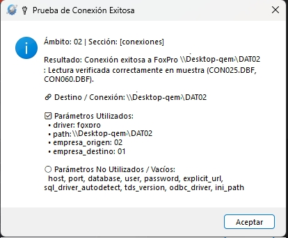
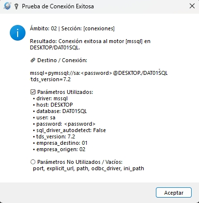

[🇪🇸 Español](README.md) | [🇺🇸 English](README.en.md)

---

# pkg-asiscfg

Modular Python library and graphical viewer/editor (GUI) for centralized management, strict schema validation, and secure encryption of configuration files.

[](LICENSE)
[](https://www.python.org/downloads/)
[](https://cryptography.io/)

---

## 📋 Table of Contents

- [Key Features](#-key-features)
- [Security Model and Cryptographic Architecture](#-security-model-and-cryptographic-architecture)
  - [1. Strategy Pattern and Supported Cryptographic Engines](#1-strategy-pattern-and-supported-cryptographic-engines)
  - [2. Engine and Storage Format Comparison](#2-engine-and-storage-format-comparison)
  - [3. Principle of Minimal Exposure (Lazy / Just-In-Time Decryption)](#3-principle-of-minimal-exposure-lazy--just-in-time-decryption)
  - [4. Secure In-Memory Password Comparison (Safe Match)](#4-secure-in-memory-password-comparison-safe-match)
  - [5. Plaintext Password Detection and Automated Sanitation](#5-plaintext-password-detection-and-automated-sanitation)
  - [6. Access Control, Hashing and UAC Elevation](#6-access-control-hashing-and-uac-elevation)
  - [7. Immutable Operations Audit](#7-immutable-operations-audit)
- [Project Architecture](#-project-architecture)
- [Prerequisites](#-prerequisites)
- [Installation and Setup](#-installation-and-setup)
- [Usage Modes](#-usage-modes)
  - [1. Graphical User Interface (GUI)](#1-graphical-user-interface-gui)
  - [2. Modular Python Library Usage](#2-modular-python-library-usage)
  - [3. CLI and Available Options](#3-cli-and-available-options)
- [Data Access API (`ConfigDict`)](#-data-access-api-configdict)
  - [Access Methods Summary](#access-methods-summary)
  - [Hierarchical Cascading Inheritance (`valor_parent` / `valorpass_parent`)](#hierarchical-cascading-inheritance-valor_parent--valorpass_parent)
  - [Profile Management](#profile-management)
- [Schema Definition (`config_schema.py`)](#-schema-definition-config_schemapy)
  - [Full `config_schema.py` Example](#full-config_schemapy-example)
  - [Schema Breakdown and Structure](#schema-breakdown-and-structure)
  - [Connection Test Buttons (`test_connection`)](#connection-test-buttons-test_connection)
  - [Automated Backup Policy (`_backup`)](#automated-backup-policy-_backup)
- [Standalone Executable Build (PyInstaller)](#-standalone-executable-build-pyinstaller)
- [Critical Security and Operational Considerations](#-critical-security-and-operational-considerations)
- [Frequently Asked Questions & Troubleshooting](#-frequently-asked-questions--troubleshooting)
- [Authorship and Credits](#-authorship-and-credits)
- [License](#-license)

---

## 🚀 Key Features

- **Multi-Cryptographic Architecture and Storage Formats:**
  - **Hybrid Plain Text Mode (`format_mode="plain"`, default):** Stores the configuration in human-readable, indented JSON format with `# ASISCFG_PLAIN` header, granularly encrypting **only sensitive fields** (`"is_password": True`) with secure tokens `"password": "ENC:..."`. Allows inspecting and editing general parameters (ports, IPs, server names, flags) using standard text editors (Notepad, VS Code).
  - **Fernet Total Encryption Mode (`format_mode="fernet"`):** Encrypts the entire configuration payload in an authenticated symmetric binary block with Fernet (AES-128-CBC + HMAC-SHA256) under header `# ASISCFG_FERNET`.
  - **AES-256-GCM Total Encryption Mode (`format_mode="aes256_gcm"`):** Encrypts the entire file with NIST standard 256-bit Authenticated Encryption with Associated Data (AEAD) (96-bit Nonce + 128-bit Tag) under header `# ASISCFG_AES256GCM`.
  - **ChaCha20-Poly1305 Total Encryption Mode (`format_mode="chacha20"`):** Encrypts the entire file with high-performance RFC 8439 AEAD stream cipher (96-bit Nonce + 128-bit Poly1305 Tag) under header `# ASISCFG_CHACHA20`.
  - **Strict Header Autodetection:** `load_config()` inspects initial bytes to transparently identify format modes and crypto engines without requiring manual hints.
  - **Arbitrary Filenames & Extensions:** Supports any extension (`config.enc`, `config.json`, `config.cfg`, etc.).
- **Secure Data Access Model (`ConfigDict`):**
  - **Password Masking:** `valor()` and `valor_profile()` return protective masks `<pass_section.key>` preventing accidental credential leakage in logs, UI outputs, or debug traces.
  - **Just-In-Time (JIT) Decryption:** `valorpass()` and `valorpass_profile()` decrypt credentials in memory only at the exact millisecond of invocation.
  - **Atomic In-Memory Comparison:** `valorpass(..., valor_compara="pass")` safely compares passwords atomically returning a boolean (`True`/`False`), avoiding plaintext variable retention.
  - **Hierarchical Cascading Inheritance:** `valor_parent()` and `valorpass_parent()` resolve values with priority: Profile (`@profiles.<id>.<sec>.<key>`) ➔ Global (`<sec>.<key>`) ➔ Schema default.
- **Modern Graphical User Interface (CustomTkinter):**
  - **Origin Read Indicator:** Displays in header whether the active file loaded as `📄 Read origin: Plain Text (Editable)` or under an encrypted mode.
  - **Dedicated Save Actions:** Dedicated buttons for saving in plain editable or total encrypted mode based on operational requirements.
  - **Strict Visual Validation:** Real-time validation of numerical types, ranges (`min`/`max`), enums, and required fields before saving.
  - **Integrated Connection Testing (`test_connection`):** Configurable schema buttons to test database connectivity (SQL Server, PostgreSQL, MySQL, SQLite, FoxPro/DBF) delegating to `pkg-asisdb`.
  - **Multi-Profile Management:** Create, clone, rename, delete, and customize company profiles based on `_template`.
  - **Built-in Viewers:** Modal viewers for JSON configuration snapshot and interactive schema structure.
- **Security & Access Control:**
  - Administrative login protected by SHA-256 hash (`admin_pass_hash`).
  - Windows UAC Administrator verification for production system modification, with a `--dev` development bypass flag.
  - Traceable audit trail saved to `audit.log`.

---

## 🛡️ Security Model and Cryptographic Architecture

`pkg-asiscfg` implements a modular architecture based on the **Strategy Pattern** to ensure confidentiality, authenticity, integrity, and non-repudiation.

```mermaid
flowchart TD
    subgraph Storage["On-Disk Storage (Format Modes)"]
        PlainMode["Hybrid Plain Mode<br/>(# ASISCFG_PLAIN)<br/>Plaintext JSON + Encrypted Passwords 'ENC:...'"]
        FernetMode["Fernet Mode<br/>(# ASISCFG_FERNET)<br/>Binary Payload AES-128-CBC + HMAC"]
        AesGcmMode["AES-256-GCM Mode<br/>(# ASISCFG_AES256GCM)<br/>AEAD Payload 256-bit + Nonce 96-bit + Tag 128-bit"]
        ChaChaMode["ChaCha20-Poly1305 Mode<br/>(# ASISCFG_CHACHA20)<br/>AEAD Payload RFC 8439 + Tag Poly1305"]
    end

    subgraph CryptoStrategy["Cryptographic Engines (asiscfg.crypto)"]
        BaseEngine["BaseFormatEngine<br/>(Abstract Interface)"]
        EngPlain["PlainFormatEngine"]
        EngFernet["FernetFormatEngine"]
        EngAes["Aes256GcmFormatEngine"]
        EngChaCha["ChaCha20FormatEngine"]
        KeyFile["Master Key File<br/>(secret.key / 32 bytes / Base64 urlsafe)"]
        
        BaseEngine --> EngPlain
        BaseEngine --> EngFernet
        BaseEngine --> EngAes
        BaseEngine --> EngChaCha
        KeyFile --> CryptoStrategy
    end

    subgraph MemoryModel["Secure In-Memory Model (ConfigDict)"]
        PlainVars["General Variables in Plaintext<br/>(host, port, debug, flags, paths)"]
        EncTokens["Encrypted Tokens in Memory<br/>('ENC:...')"]
    end

    subgraph AccessAPI["Secure Access API"]
        ValorCall["cfg.valor('database.password')<br/>➔ Returns: &lt;pass_database.password&gt; (Masked)"]
        ValorPassCall["cfg.valorpass('database.password')<br/>➔ JIT In-Memory Decryption (Plaintext)"]
        ValorPassComp["cfg.valorpass('db.pass', valor_compara='...')<br/>➔ Atomic Comparison (True / False)"]
    end

    Storage --> CryptoStrategy
    CryptoStrategy --> MemoryModel
    MemoryModel --> AccessAPI
```

### 1. Strategy Pattern and Supported Cryptographic Engines

The module [`asiscfg.crypto`](file:///d:/COMSISA%20Proyectos/pkg-asiscfg/asiscfg/crypto.py) defines the canonical registry `FORMAT_MODES` with four specialized engines extending `BaseFormatEngine`:

1. **`PlainFormatEngine` (`format_mode="plain"`)**:
   - **File Header:** `# ASISCFG_PLAIN`.
   - **Payload Structure:** Human-readable, indented plaintext JSON (UTF-8).
   - **Sensitive Fields:** Every field marked with `"is_password": True` is individually encrypted generating an `ENC:<token>` token using the master key.
   - **Null/Empty Values:** Strictly normalized to the canonical sentinel `NULL_SENTINEL` (`"<%null$>"`), preventing empty password exposure.

2. **`FernetFormatEngine` (`format_mode="fernet"`)**:
   - **File Header:** `# ASISCFG_FERNET`.
   - **Algorithm:** Symmetric **AES with 128-bit key in CBC mode** with PKCS7 padding.
   - **Integrity & Authenticity:** Cryptographic signature via **HMAC-SHA256** computed over initialization vector (IV) and ciphertext.
   - **Unique IV:** Random 128-bit IV and 64-bit timestamp for each encryption operation.

3. **`Aes256GcmFormatEngine` (`format_mode="aes256_gcm"`)**:
   - **File Header:** `# ASISCFG_AES256GCM`.
   - **Algorithm:** **AES-256-GCM** (Galois/Counter Mode), industry standard for Authenticated Encryption with Associated Data (AEAD).
   - **Payload Structure:** 96-bit Nonce (12 random bytes) + Ciphertext + 128-bit Authentication Tag (16 bytes), encoded in Base64 urlsafe.
   - **Security:** Maximum 256-bit strength with integrated cryptographic tamper verification.

4. **`ChaCha20FormatEngine` (`format_mode="chacha20"`)**:
   - **File Header:** `# ASISCFG_CHACHA20`.
   - **Algorithm:** **ChaCha20-Poly1305** (RFC 8439), high-performance 256-bit stream cipher authenticated with Poly1305.
   - **Payload Structure:** 96-bit Nonce (12 random bytes) + Ciphertext + 128-bit Poly1305 Tag, encoded in Base64 urlsafe.
   - **Performance:** Superior throughput and resistance to timing side-channel attacks across CPU architectures.

### 2. Engine and Storage Format Comparison

| Format Mode | Identifier | Canonical Header | Algorithm / AEAD | Required Key | External JSON Editing |
| :--- | :--- | :--- | :--- | :--- | :--- |
| **Hybrid Plain Text** | `plain` | `# ASISCFG_PLAIN` | Granular `ENC:...` tokens | 32 bytes (Base64) | ✅ Yes (general variables) |
| **Fernet Total** | `fernet` | `# ASISCFG_FERNET` | AES-128-CBC + HMAC-SHA256 | 32 bytes (Fernet/Base64) | ❌ No (requires GUI/Library) |
| **AES-256-GCM Total** | `aes256_gcm` | `# ASISCFG_AES256GCM` | AES-256-GCM (NIST AEAD) | 32 bytes (256-bit Base64) | ❌ No (requires GUI/Library) |
| **ChaCha20 Total** | `chacha20` | `# ASISCFG_CHACHA20` | ChaCha20-Poly1305 (RFC 8439) | 32 bytes (256-bit Base64) | ❌ No (requires GUI/Library) |

### 3. Principle of Minimal Exposure (Lazy / Just-In-Time Decryption)
To prevent accidental exposure in stack traces, memory dumps, or log files:
- When loading configuration into memory with `load_config()`, fields with `"is_password": True` are **not decrypted en masse**; they are held in memory as encrypted tokens (`ENC:...`).
- If code invokes `cfg.valor("database.password")` or prints `print(cfg.valor(...))`, the library **never exposes the password** and returns `<pass_database.password>`.
- Decryption happens **exclusively on demand (Just-In-Time)** when calling `cfg.valorpass()` or `cfg.valorpass_profile()`.

### 4. Secure In-Memory Password Comparison (Safe Match)
When checking whether user input matches a stored credential, there is no need to assign decrypted plaintext to intermediate variables:
```python
# Atomic verification without keeping plaintext in intermediate variables:
is_valid = config.valorpass("database.password", valor_compara=user_input)
# Returns True if matches, False otherwise
```

### 5. Plaintext Password Detection and Automated Sanitation
- If an operator manually edits the JSON configuration and enters plaintext in a password field (omitting `ENC:`):
  - In production mode (`edit_mode=False`), `asiscfg` detects the security anomaly and halts execution reporting the fault.
  - In GUI mode (`edit_mode=True`), `cfg.get_unencrypted_passwords()` flags the exposed keys and prompts a warning modal (`PlaintextPasswordsWarningDialog`), automatically encrypting them upon saving.

### 6. Access Control, Hashing and UAC Elevation
- **Admin Password:** GUI configuration tool access is guarded by a unidirectional **SHA-256 cryptographic hash** in `@asiscfg.admin_pass_hash` (`hash_password()`).
- **Windows UAC Verification:** Prevents unauthorized local users from changing system service configs via `is_admin()`. The `--dev` flag bypasses elevation for development/testing.

### 7. Immutable Operations Audit
- Critical operations (GUI opening, login attempts, admin password updates, and save events) are logged with ISO timestamps in `audit.log`.

---

## 🏗 Project Architecture

```text
pkg-asiscfg/
├── asiscfg/                  # Modular Python package (pkg-asiscfg)
│   ├── __init__.py               # Public API facade and exports
│   ├── constants.py              # System constants, defaults, and version signatures
│   ├── core.py                   # Loading, saving, hybrid encryption, backup, and schemas
│   ├── crypto.py                 # Cryptographic engines (Plain, Fernet, AES-256-GCM, ChaCha20)
│   ├── models.py                 # ConfigDict model, valor/valorpass, and cascading resolution
│   ├── schema.py                 # Type validation, range bounds, and schema metadata
│   ├── security.py               # SHA-256 hashing, UAC elevation check, and audit logs
│   ├── resources/                # Package resources (i18n catalogs, logo.ico)
│   └── ui/                       # Visual layer (CustomTkinter)
│       ├── app.py                # Main window, dynamic profile tabs, UI validation
│       ├── dialogs.py            # Modals (login, password reset, companies, JSON viewer)
│       └── utils.py              # Colors, palettes, themes, and icons
├── resources/                    # Root distribution assets
├── tests/                        # Automated unit test suite
│   ├── test_config_package.py    # Schema tests, encryption, and profile tests
│   ├── test_connection_mapping.py# Connection mapping and wildcard interpolation
│   └── test_ui_profile_validation.py # UI validation and password integrity tests
├── build_exe.py / .ps1           # PyInstaller build scripts
├── pyproject.toml                # Package metadata (name = "pkg-asiscfg")
├── requirements.txt              # Standard development dependencies
└── README.md                     # Spanish technical documentation
```

---

## 📦 Prerequisites

- **Python:** Version `3.8` or newer.
- **Operating System:** Windows 7 / 8 / 10 / 11 / Windows Server (or Linux for headless core usage).
- **Sister Packages:**
  - `pkg-i18n` (Internationalization and localization)
  - `pkg-asisdb` (Database connectivity and testing)

---

## ⚙️ Installation and Setup

### 1. Clone and Create Virtual Environment

```powershell
# Navigate to project directory
cd "pkg-asiscfg"

# Create virtual environment
python -m venv .venv

# Activate virtual environment
.\.venv\Scripts\Activate.ps1
```

### 2. Install Dependencies

```powershell
pip install -r requirements.txt
pip install -e .
```

---

## 🖥 Usage Modes

### 1. Graphical User Interface (GUI)

To open the configuration GUI in development mode:

```powershell
python asiscfg.py --schema-file "..\PATH_TO_SCHEMA\config_schema.py" --config-file "..\PATH_TO_CONFIG\config.cfg" --key-file "..\PATH_TO_KEY\config.key" --dev --app
```

#### GUI Authentication Flow:
1. When opening a new or uninitialized file, the default master password is: `admin`.
2. In production mode (without `--dev`), the tool requires **Administrator** privileges (Windows UAC elevation).
3. **Read Origin Header:** The top bar informs whether the file loaded in plain editable or fully encrypted mode.
4. **Saving:** Offers dedicated buttons to save in plain editable or total encrypted mode.

#### Interface Screenshots:

**1. Application Metadata Tab (`app` enabled with `--app`):**


**2. General Parameters and Paths Tab (`general` / `paths`):**


**3. Global Connections Tab (`conexiones`):**


---

### 2. Modular Python Library Usage

```python
from asiscfg import load_config, save_config

# 1. Load configuration (autodetects plain, fernet, aes256_gcm, or chacha20)
config = load_config(
    config_path="config.cfg",
    key_path="config.key"
)

# Inspect detected origin format ('plain', 'fernet', 'aes256_gcm', 'chacha20')
print("Detected origin format:", config.format_mode)

# 2. Access general non-sensitive parameters
app_name = config.valor("app.name", default="My App")
db_host = config.valor("conexiones.host", default="127.0.0.1")
db_port = config.valor("conexiones.port", default=1433)

# 3. Access passwords (JIT Decryption)
# NOTE: config.valor("conexiones.password") returns "<pass_conexiones.password>"
db_pass = config.valorpass("conexiones.password")

# 4. In-memory comparison without plaintext leakage
is_match = config.valorpass("conexiones.password", valor_compara="secret123")

# 5. Access multi-company profile settings (@profiles)
active_profile = "01"
emp_name = config.valor_profile(active_profile, "info.name")
emp_pass = config.valorpass_profile(active_profile, "conexiones.password")

# 6. Cascading inheritance: Profile -> Global -> Default
eff_host = config.valor_parent("conexiones.host", profile_code=active_profile)
eff_pass = config.valorpass_parent("conexiones.password", profile_code=active_profile)

# 7. Modify values and save
config["conexiones"]["host"] = "192.168.1.50"

# Save in hybrid plain text mode (default):
save_config("config.cfg", "config.key", dict(config), format_mode="plain")

# Or save in total encrypted modes:
# save_config("config.cfg", "config.key", dict(config), format_mode="fernet")
# save_config("config.cfg", "config.key", dict(config), format_mode="aes256_gcm")
# save_config("config.cfg", "config.key", dict(config), format_mode="chacha20")
```

---

### 3. CLI and Available Options

The CLI entrypoint `python asiscfg.py` supports the following arguments:

| Option | Type | Description |
| :--- | :--- | :--- |
| `--config-file` | `Path` | Path to configuration file (default: `config.enc`, supports `.json`, `.cfg`, etc.). |
| `--key-file` | `Path` | Path to master key file (default: `secret.key`). |
| `--schema-file` | `Path` | Path to schema definition file `.py` exporting `DEFAULT_CONFIG`. |
| `--format-mode` | `String` | Target save mode: `'plain'` (default), `'fernet'`, `'aes256_gcm'`, `'chacha20'`. |
| `--theme` | `String` | Visual appearance mode: `'dark'` (default), `'light'`, or `'system'`. |
| `--dev` | `Flag` | **Development mode:** Bypasses mandatory UAC Administrator checks. |
| `--app` | `Flag` | Allows editing parameters inside the `app` section in the GUI. |
| `--reset-admin-pass` | `Flag` | Resets admin password back to `'admin'` directly from CLI without opening GUI. |
| `--export-schema` | `Flag` | Exports base schema template `config_schema.py` to target path. |
| `--i18n-path` | `Path` | Custom external translation catalogs path for host application. |

---

## 📊 Data Access API (`ConfigDict`)

The `ConfigDict` class extends `dict` with specialized security and inheritance methods:

### Access Methods Summary

| Method | Field Type | Behavior |
| :--- | :--- | :--- |
| `valor(key_path, default=None)` | Non-Password | Returns raw value. |
| `valor(key_path, default=None)` | Password (`is_password: True`) | Returns security mask `<pass_{key_path}>`. |
| `valorpass(key_path, default="", valor_compara=None)` | Password (`is_password: True`) | If `valor_compara` is `None`, decrypts JIT and returns plaintext (or `""` if empty). If provided, returns boolean match (`True`/`False`). |
| `valorpass(key_path, default="", valor_compara=None)` | Non-Password | Returns variable mask `<var_{key_path}>`. |
| `valor_profile(profile_code, key_path, default=None)` | Non-Password / Password | Same behavior as `valor()`, scoped to `@profiles.<profile_code>`. |
| `valorpass_profile(profile_code, key_path, ...)` | Non-Password / Password | Same behavior as `valorpass()`, scoped to `@profiles.<profile_code>`. |
| `valor_parent(key_path, profile_code="", default="", key_path_parent="")` | Non-Password / Password | Resolves hierarchically: Profile ➔ Global ➔ Default. Masks passwords. |
| `valorpass_parent(key_path, profile_code="", default="", key_path_parent="", ...)` | Non-Password / Password | Resolves hierarchically and decrypts JIT password fields. |

### Profile Management
- `cfg.get_profiles()`: Returns list of profile codes under `@profiles` (e.g. `["01", "02"]`).
- `cfg.has_profiles()`: Returns `True` if active configuration has profiles.
- `cfg.get_profile_config(profile_code)`: Returns full profile dictionary.
- `cfg.get_unencrypted_passwords()`: Returns list of `(key, value)` tuples of unencrypted password fields detected on load.

#### Profile Management Screenshots:

**1. Dynamic & Alphabetical Profile / Company Selector:**


**2. Profile Information (Company Name & Codes):**


**3. Company Specific Connection Settings & Connectivity Test:**


---

## 📝 Schema Definition (`config_schema.py`)

### Full `config_schema.py` Example

Below is the complete canonical configuration schema file centralizing application metadata, general parameters, global paths, multi-engine database connections, and multi-profile (companies) configuration:

```python
# -*- coding: utf-8 -*-
from typing import Dict, Any
from asisdb import get_supported_drivers, LITERAL
from asiscfg import SCHEMA_KEY

"""
Esquema de Configuración para configurar un entorno FoxPro y otro SQL.
Centraliza servidor SQL, credenciales y plantillas con comodines {empresa_destino} y {empresa_origen}.
"""
DEFAULT_CONFIG: Dict[str, Any] = {
    # ── 1. Metadatos de la Aplicación ──
    "app": {
        "name": {"default": "DEMO - Asientos Contables", "description": "t18n#Nombre del sistema de sincronización."},
        "version": {"default": "v1.0.0", "description": "t18n#Versión del aplicativo."},
        "client": {"default": "DEMO", "description": "t18n#Cliente o empresa propietaria."}
    },

    # ── 2. Parámetros Generales ──
    "general": {
        "active_language": {"default": "es", "description": "t18n#Código del idioma activo (ej. es)."},
        "log_filename_pattern": {"default": "{TIMESTAMP}.log", "description": "t18n#Patrón de nombres de logs."},
        "backup_config_pattern": {"default": "{TIMESTAMP}-{BASENAME}{EXT}.bak", "description": "t18n#Patrón de nombres de backups de configuración."},
        "monto_tolerance": {"default": "0.01", "description": "t18n#Tolerancia para la cuadratura contable."},
    },

    # ── 3. Rutas Globales ──
    "paths": {
        "resources": {"default": "resources", "description": "t18n#Directorio de recursos e interfaz."},
        "languages": {"default": "resources/languages", "description": "t18n#Directorio de idiomas e i18n."},
        "logs": {"default": "logs", "description": "t18n#Directorio de almacenamiento de logs."},
        "asientos_ini": {"default": "asientos.ini", "description": "t18n#Ruta al archivo asientos.ini del sistema."},
        "schema_campos_path": {"default": "campos.json", "description": "t18n#Ruta al archivo con campos extras/modificados/excluidos."},
        "backup_config_path": {"default": "{ROOT}/backups", "description": "t18n#Ruta al archivo de respaldo de la configuración."}
    },

    # ── 4. Conexiones Fox / SQL Globales ──
    "conexiones": {
        # Plantilla global FoxPro (acepta comodín {empresa_origen})
        "fox_path": {
            "default": "\\\\SRV\\CONDAT{empresa_origen}", 
            "description": "t18n#Plantilla de ruta FoxPro/SA (soporta comodín {empresa_origen})."
        },
        # Motor y credenciales SQL Globales
        "driver": {
            "default": "mssql", 
            "description": "t18n#Motor de Base de Datos SQL global.", 
            "type": "enum", 
            "options": get_supported_drivers()
        },
        "host": {"default": "SQLSERVER", "description": "t18n#Servidor SQL principal para todos los perfiles."},
        "port": {"default": "", "description": "t18n#Puerto de escucha TCP/IP SQL (vacío para default del driver)."},
        "user": {"default": "sa", "description": "t18n#Usuario SQL principal."},
        "password": {"default": "", "description": "t18n#Contraseña SQL principal.", "is_password": True},
        # Plantilla de base de datos (acepta comodín {empresa_destino})
        "database": {
            "default": "DAT{empresa_destino}DBSQL", 
            "description": "t18n#Plantilla de Base de Datos SQL (soporta comodín {empresa_destino})."
        },
        "odbc_driver": {"default": "", "description": "t18n#Driver ODBC a utilizar (opcional)."},
        "sql_driver_autodetect": {"default": "False", "description": "t18n#Autodetectar Driver ODBC instalado."},
        "tds_version": {"default": "", "description": "t18n#Versión del protocolo TDS para pymssql (7.2, 7.4, etc)."}
    },

    # ── 5. Configuración Multi-Perfil (Empresas) ──
    "@profiles": {
        "_template": {
            "info": {
                "name": {"default": "", "description": "t18n#Descripción del perfil/empresa."},
                "empresa_origen": {"default": "01", "description": "t18n#Código de Empresa Origen (FoxPro)."},
                "empresa_destino": {"default": "01", "description": "t18n#Código de Empresa Destino (SQL Server)."}
            },
            "conexiones": {
                "fox_path": {"default": "", "description": "t18n#Ruta FoxPro específica (dejar vacío para heredar de conexiones.fox_path)."},
                "btn_test_foxpro": {
                    "type": "test_connection",
                    "description": "t18n#📁 Probar Conexión FoxPro",
                    "mapping": {
                        "driver": LITERAL("foxpro"),
                        "path": ["fox_path", "conexiones.fox_path"],
                        "empresa_origen": "info.empresa_origen",
                        "empresa_destino": "info.empresa_destino"
                    }
                },
                # Sobreescritura específica por perfil (vacío hereda de conexiones global)
                "driver": {
                    "default": "", 
                    "description": "t18n#Motor SQL específico (dejar vacío para heredar de conexiones.driver).", 
                    "type": "enum", 
                    "options": ["", *get_supported_drivers()]
                },
                "host": {"default": "", "description": "t18n#Servidor SQL específico (dejar vacío para heredar de conexiones.host)."},
                "port": {"default": "", "description": "t18n#Puerto de escucha TCP/IP SQL (dejar vacío para heredar de conexiones.port)."},
                "user": {"default": "", "description": "t18n#Usuario SQL específico (dejar vacío para heredar de conexiones.user)."},
                "password": {"default": "", "description": "t18n#Contraseña específica (dejar vacío para heredar de conexiones.password).", "is_password": True},
                "database": {"default": "", "description": "t18n#Base de datos específica (dejar vacío para heredar de conexiones.database)."},
                "odbc_driver": {"default": "", "description": "t18n#Driver ODBC específico (dejar vacío para heredar de conexiones.odbc_driver)."},
                "sql_driver_autodetect": {
                    "default": "", 
                    "description": "t18n#Autodetectar Driver ODBC instalado (dejar vacío para heredar de conexiones.sql_driver_autodetect)." 
                },
                "tds_version": {"default": "", "description": "t18n#Versión del protocolo TDS (dejar vacío para heredar de conexiones.tds_version)."},
                "btn_test_sql": {
                    "type": "test_connection",
                    "description": "t18n#🔌 Probar Conexión SQL Empresa",
                    "mapping": {
                        "driver": ["driver", "conexiones.driver"],
                        "host": ["host", "conexiones.host"],
                        "port": ["port", "conexiones.port"],
                        "database": ["database", "conexiones.database"],
                        "user": ["user", "conexiones.user"],
                        "password": ["password", "conexiones.password"],
                        "odbc_driver": ["odbc_driver", "conexiones.odbc_driver"],
                        "empresa_destino": "info.empresa_destino",
                        "empresa_origen": "info.empresa_origen",
                        "sql_driver_autodetect": ["sql_driver_autodetect", "conexiones.sql_driver_autodetect"],
                        "tds_version": ["tds_version", "conexiones.tds_version"]
                    }
                }
            }
        },

        # Perfil inicial por defecto
        "01": {
            "info": {
                "name": "",
                "empresa_origen": "",
                "empresa_destino": ""
            },
            "conexiones": {
                "fox_path": "",
                "driver": "",
                "host": "",
                "port": "",
                "user": "",
                "password": "",
                "database": "",
                "odbc_driver": "",
                "sql_driver_autodetect": "",
                "tds_version": ""
            }
        }
    },

    # ── Política de Respaldos de Configuración ──
    "_backup": {
        "enabled": True,
        "method": "timestamp",
        "target_dir": SCHEMA_KEY("paths.backup_config_path"),
        "filename_pattern": SCHEMA_KEY("general.backup_config_pattern"),
        "max_backups": 20
    }
}
```

---

### Schema Breakdown and Structure

The schema is divided into 6 core sections:

1. **Application Metadata (`app`):**
   - Identifies application name (`name`), version (`version`), and client/owner (`client`).
   - Locked in GUI by default to protect branding, unless launched with the `--app` flag.

2. **General Parameters (`general`):**
   - Active language code (`active_language`) for dynamic localization via `pkg-i18n`.
   - Logging and backup filename patterns (`{TIMESTAMP}.log`, `{TIMESTAMP}-{BASENAME}{EXT}.bak`).
   - Numerical business tolerance limits (`monto_tolerance`).

3. **Global Paths (`paths`):**
   - Centralizes resource, log, and translation folders.
   - Supports the `{ROOT}` wildcard which dynamically expands to the host application's root execution path.

4. **Global Fox / SQL Connections (`conexiones`):**
   - Wildcard template support (`\\\\SRV\\ORBIS\\ORBISDAT\\CONDAT{empresa_origen}`, `DAT{empresa_destino}DBSQL`).
   - Integration with `asisdb.get_supported_drivers()` to enumerate available database engines (`mssql`, `postgresql`, `mysql`, `sqlite`, `foxpro`).
   - Protected credential fields (`"is_password": True`).

5. **Multi-Profile Configuration (`@profiles`):**
   - The special `@profiles` section models collections of repetitive, independent profiles or environments (with companies, branches, clients, or projects being the most common use cases).
   - **Base template `_template`:** Defines the field and button structure automatically inherited whenever a new profile is added or cloned in the GUI.
   - **Cascading inheritance:** Fields left blank in a specific profile automatically inherit the values configured in the corresponding global section (e.g. `conexiones`).
   - **Interactive test buttons:** Test connectivity independently for each profile (in this example, FoxPro and SQL Server).

6. **Backup Policy (`_backup`):**
   - Reactive parameter binding using `SCHEMA_KEY("paths.backup_config_path")` and `SCHEMA_KEY("general.backup_config_pattern")`.

> [!TIP]
> **Internationalization with `t18n#` prefix:**
> Prefacing descriptions with `t18n#` (e.g. `"description": "t18n#Application Name"`) automatically invokes `pkg-i18n` for dynamic multi-language translation in the GUI.

---

### Connection Test Buttons (`test_connection`)

Allow testing database connectivity directly from the UI with `"type": "test_connection"` and parameter `"mapping"`:
- **`LITERAL(value)`:** Assigns a fixed literal constant directly to the connection argument (e.g. `LITERAL("foxpro")`).
- **Cascading Fallback Lists:** Resolves the first non-empty value:
  ```python
  "host": ["host", "conexiones.host"]
  ```
  *(Checks profile-specific `conexiones.host` first; falls back to global `conexiones.host` if empty).*
- **Dynamic Placeholders:** Automatic interpolation of variables defined in the profile (in this example, `{empresa_destino}` and `{empresa_origen}`) in FoxPro paths and SQL database names.
- **Isolation:** Test buttons are UI-only actions and are never written to the final saved configuration.

#### Profile Connection Test Screenshots:

**1. Company Specific Connection Settings with Test Buttons:**


**2. Successful Connection Modal - FoxPro / DBF Tables:**


**3. Successful Connection Modal - SQL Server:**



---

### Automated Backup Policy (`_backup`)

```python
DEFAULT_CONFIG = {
    "_backup": {
        "enabled": True,                                        # Enable/disable automated backups
        "method": "timestamp",                                  # "timestamp" (rotated dates), "simple" (.bak), "none"
        "target_dir": SCHEMA_KEY("paths.backup_config_path"),    # Path linked to schema or static path with {ROOT}
        "filename_pattern": SCHEMA_KEY("general.backup_config_pattern"), # Custom filename pattern with wildcards
        "max_backups": 20                                       # Maximum retained historical backups (0 = unlimited)
    }
}
```

---

## 📦 Standalone Executable Build (PyInstaller)

To build the self-contained standalone executable:

```powershell
python .\build_exe.py
```
*(Or by executing `.\build_exe.ps1`)*.

The resulting executable will be created at `dist/asiscfg/asiscfg.exe`.

---

## 🔒 Critical Security and Operational Considerations

> [!WARNING]
> **Master Key Management (`secret.key` / `config.key`):**
> 1. Contains the cryptographic key (32 bytes / 44 characters Base64 urlsafe) required to decrypt the entire configuration or individual `ENC:...` fields.
> 2. **NEVER** commit secret key files to version control or public repositories.
> 3. If lost or destroyed, encrypted passwords and configurations **cannot be recovered** without a prior secure backup.
> 4. In production, configure read-only NTFS permissions for the specific service user account.
> 5. For key disaster recovery and rotation procedures, see the [Security and Key Recovery Guide](docs/SECURITY.md).

---

## ❓ Frequently Asked Questions & Troubleshooting

### 1. `RuntimeError: [ERROR] customtkinter no está instalado en este entorno`
- **Cause:** The script was executed with global Python or the virtual environment is inactive.
- **Solution:** Activate virtual environment before running:
  ```powershell
  .\.venv\Scripts\Activate.ps1
  python asiscfg.py
  ```

### 2. Administrator Permissions Error (UAC)
- **Cause:** In production mode, modifying service configurations requires elevated permissions.
- **Solution:** Launch PowerShell as Administrator, or pass `--dev` for local development.

### 3. Forgot Admin Password
- **Solution:** Run the CLI command to reset the password back to default (`admin`):
  ```powershell
  python asiscfg.py --reset-admin-pass
  ```

---

## 👥 Authorship and Credits

* **Author:** [Boris Pinto](https://github.com/borispinto) (`borispinto@asisnet.net`)
* **Maintainer:** [Asisnet Computacion, CA](https://www.asisnet.net) (`proyectos@asisnet.net` / `soporte@asisnet.net`)
* **Official Repository:** [github.com/borispinto/pkg-asiscfg](https://github.com/borispinto/pkg-asiscfg)

---

## 📄 License

This project is licensed under the **MIT License** - see the [LICENSE](LICENSE) file for details.

Copyright (c) 2026 Asisnet Computación, CA & Boris Pinto.
