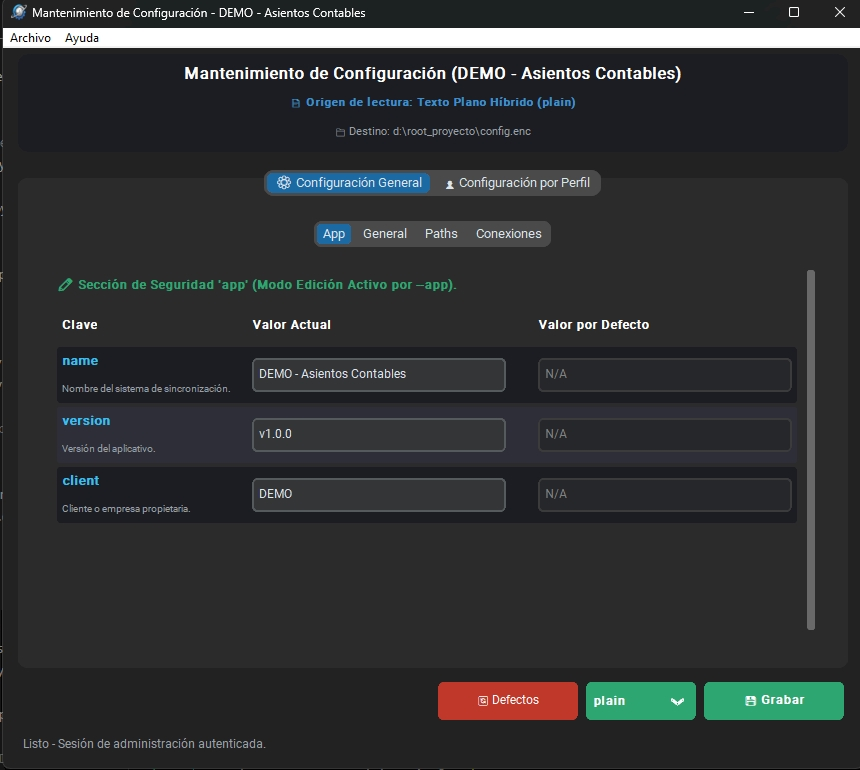
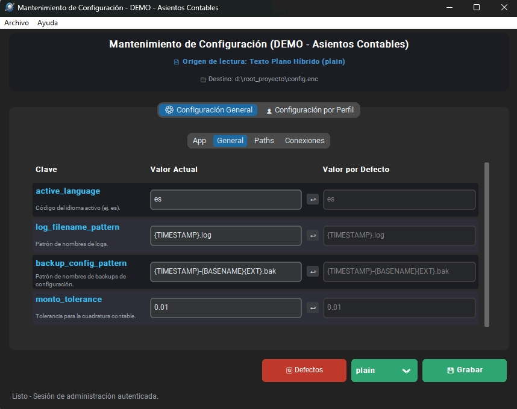
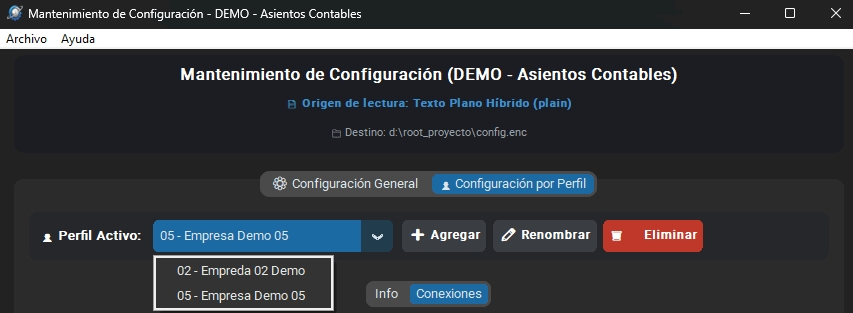
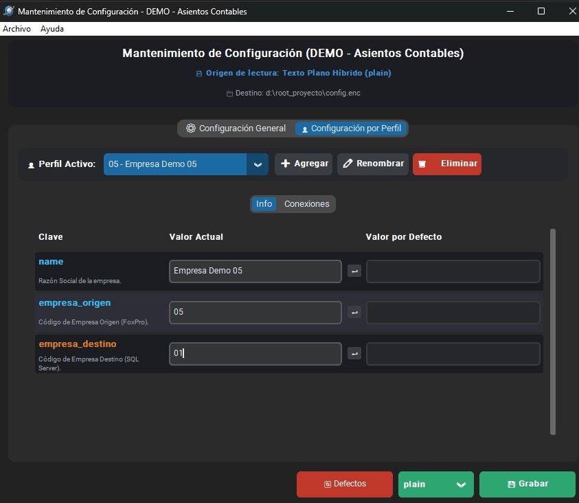
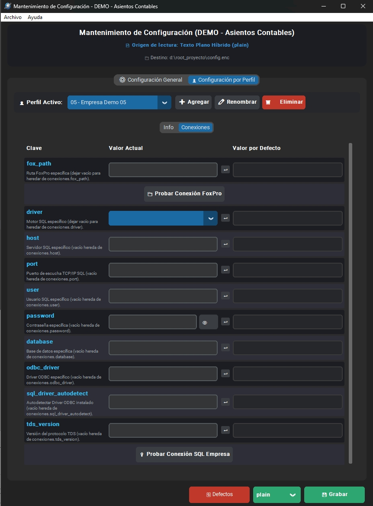
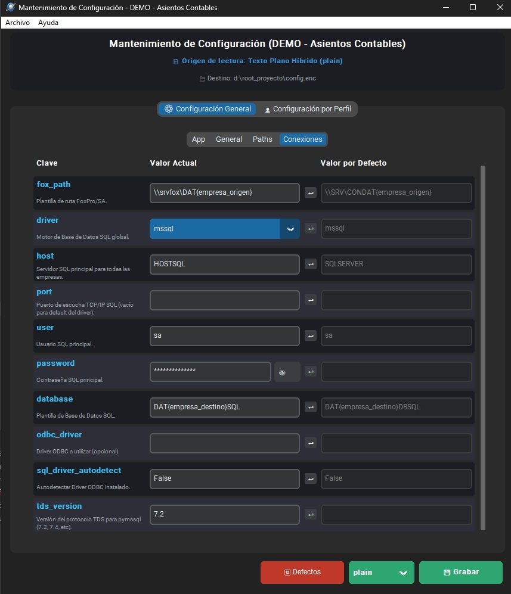

[🇪🇸 Español](README.md) | [🇺🇸 English](README.en.md)

---

# pkg-asiscfg

Librería modular y visor/editor gráfico (GUI) para la gestión centralizada, validación y cifrado seguro de archivos de configuración.

[](LICENSE)
[](https://www.python.org/downloads/)
[](https://cryptography.io/)

---

## 📋 Tabla de Contenidos

- [Características Principales](#-características-principales)
- [Nivel de Seguridad y Arquitectura Criptográfica](#-nivel-de-seguridad-y-arquitectura-criptográfica)
  - [1. Patrón Estrategia y Motores Criptográficos Soportados](#1-patrón-estrategia-y-motores-criptográficos-soportados)
  - [2. Comparativa de Motores y Formatos de Almacenamiento](#2-comparativa-de-motores-y-formatos-de-almacenamiento)
  - [3. Principio de Mínima Exposición (Lazy / Just-In-Time Decryption)](#3-principio-de-mínima-exposición-lazy--just-in-time-decryption)
  - [4. Comparación Segura de Contraseñas (In-Memory Safe Match)](#4-comparación-segura-de-contraseñas-in-memory-safe-match)
  - [5. Detección y Saneamiento Automático de Contraseñas en Texto Claro](#5-detección-y-saneamiento-automático-de-contraseñas-en-texto-claro)
  - [6. Control de Acceso, Hashing y Elevación de Privilegios (UAC)](#6-control-de-acceso-hashing-y-elevación-de-privilegios-uac)
  - [7. Auditoría Inmutable de Operaciones](#7-auditoría-inmutable-de-operaciones)
- [Arquitectura del Proyecto](#-arquitectura-del-proyecto)
- [Requisitos Previos](#-requisitos-previos)
- [Instalación y Configuración](#-instalación-y-configuración)
- [Modos de Uso](#-modos-de-uso)
  - [1. Interfaz Gráfica (GUI)](#1-interfaz-gráfica-gui)
  - [2. Uso como Librería Modular en Python](#2-uso-como-librería-modular-en-python)
  - [3. CLI y Parámetros Disponibles](#3-cli-y-parámetros-disponibles)
- [API de Acceso a Datos (`ConfigDict`)](#-api-de-acceso-a-datos-configdict)
  - [Tabla de Métodos de Acceso](#tabla-de-métodos-de-acceso)
  - [Herencia en Cascada (`valor_parent` / `valorpass_parent`)](#herencia-en-cascada-valor_parent--valorpass_parent)
  - [Gestión de Perfiles](#gestión-de-perfiles)
- [Definición de Esquemas (`config_schema.py`)](#-definición-de-esquemas-config_schemapy)
  - [Ejemplo Completo de `config_schema.py`](#ejemplo-completo-de-config_schemapy)
  - [Desglose y Estructura del Esquema](#desglose-y-estructura-del-esquema)
  - [Botones de Prueba de Conexión (`test_connection`)](#botones-de-prueba-de-conexión-test_connection)
  - [Política de Respaldos Automáticos (`_backup`)](#política-de-respaldos-automáticos-_backup)
- [Compilación a Ejecutable Standalone (PyInstaller)](#-compilación-a-ejecutable-standalone-pyinstaller)
- [Consideraciones Críticas de Seguridad y Operación](#-consideraciones-críticas-de-seguridad-y-operación)
- [Resolución de Problemas Frecuentes](#-resolución-de-problemas-frecuentes)
- [Autoría y Créditos](#-autoría-y-créditos)
- [Licencia](#-licencia)

---

## 🚀 Características Principales

- **Arquitectura Multicriptográfica y Formatos de Almacenamiento:**
  - **Modo Texto Plano Híbrido (`format_mode="plain"`, por defecto):** Guarda la configuración en formato JSON legible e identado con cabecera `# ASISCFG_PLAIN`, cifrando de forma granular **únicamente los campos sensibles** (`"is_password": True`) bajo el token seguro `"password": "ENC:..."`. Permite inspeccionar y editar parámetros generales (puertos, IPs, nombres, flags) con cualquier editor de texto (Notepad, VS Code).
  - **Modo Cifrado Fernet (`format_mode="fernet"`):** Cifra el archivo completo en un bloque binario autenticado con Fernet (AES-128-CBC + HMAC-SHA256) con cabecera `# ASISCFG_FERNET`.
  - **Modo Cifrado AES-256-GCM (`format_mode="aes256_gcm"`):** Cifra el archivo completo utilizando AEAD autenticado estándar NIST de 256 bits (Nonce 96-bit + Tag 128-bit) con cabecera `# ASISCFG_AES256GCM`.
  - **Modo Cifrado ChaCha20-Poly1305 (`format_mode="chacha20"`):** Cifra el archivo completo mediante AEAD autenticado moderno de alto rendimiento RFC 8439 (Nonce 96-bit + Tag Poly1305 128-bit) con cabecera `# ASISCFG_CHACHA20`.
  - **Autodetección Estricta por Cabeceras:** `load_config()` detecta el formato y motor de cifrado de forma automática e instantánea inspeccionando los bytes iniciales del archivo, sin requerir parámetros manuales.
  - **Nombres y Extensiones Arbitrarias:** Admite cualquier extensión (`config.enc`, `config.json`, `config.cfg`, etc.).
- **Modelo de Acceso Seguro a Datos (`ConfigDict`):**
  - **Enmascaramiento de Contraseñas:** `valor()` y `valor_profile()` devuelven una máscara protectora `<pass_seccion.clave>` para prevenir fugas accidentales en logs, pantallas o trazas.
  - **Descifrado Just-In-Time (JIT):** `valorpass()` y `valorpass_profile()` descifran la credencial en memoria únicamente en el milisegundo exacto de su invocación.
  - **Comparación In-Memory sin Exposición:** `valorpass(..., valor_compara="pass")` valida contraseñas de forma atómica retornando un booleano (`True`/`False`), evitando asignar texto plano a variables intermedias.
  - **Herencia Jerárquica en Cascada:** `valor_parent()` y `valorpass_parent()` resuelven valores con prioridad Perfil (`@profiles.<id>.<sec>.<campo>`) ➔ Global (`<sec>.<campo>`) ➔ Default del esquema.
- **Interfaz Gráfica Moderna (CustomTkinter):**
  - **Indicador de Origen de Lectura:** Muestra en el encabezado si el archivo activo se leyó como `📄 Origen de lectura: Texto Plano (Editable)` o bajo un modo cifrado.
  - **Botones de Guardado Independientes:** Guardado directo en modo editable (plain) o cifrado según las necesidades del entorno.
  - **Validación Visual Estricta:** Validación en tiempo real de tipos numéricos, rangos (`min`/`max`), enumerados y campos obligatorios antes de permitir guardar.
  - **Prueba de Conexión Integrada (`test_connection`):** Botones configurables en el esquema para validar conectividad con bases de datos (SQL Server, PostgreSQL, MySQL, SQLite y tablas FoxPro/DBF) delegando en la librería externa `pkg-asisdb`.
  - **Gestión Multiperfil:** Alta, clonación, renombramiento, eliminación y personalización de perfiles con plantilla base `_template`.
  - **Visores Integrados:** Visores modales de la configuración activa en JSON y del esquema base interactivo.
- **Seguridad y Control de Acceso:**
  - Control de acceso administrativo protegido por hash SHA-256 (`admin_pass_hash`).
  - Validación de privilegios de Administrador (UAC en Windows) para modificaciones del sistema, con bypass `--dev` exclusivo para desarrollo.
  - Registro de auditoría trazable en `audit.log`.

---

## 🛡️ Nivel de Seguridad y Arquitectura Criptográfica

`pkg-asiscfg` implementa una arquitectura modular basada en el **Patrón Estrategia (Strategy Pattern)** que garantiza confidencialidad, autenticidad, integridad y no repudio.

```mermaid
flowchart TD
    subgraph Storage["Almacenamiento en Disco (Format Modes)"]
        PlainMode["Modo Plain Híbrido<br/>(# ASISCFG_PLAIN)<br/>Variables JSON en claro + Passwords 'ENC:...'"]
        FernetMode["Modo Fernet Total<br/>(# ASISCFG_FERNET)<br/>Payload binario AES-128-CBC + HMAC"]
        AesGcmMode["Modo AES-256-GCM<br/>(# ASISCFG_AES256GCM)<br/>Payload AEAD 256-bit + Nonce 96-bit + Tag 128-bit"]
        ChaChaMode["Modo ChaCha20-Poly1305<br/>(# ASISCFG_CHACHA20)<br/>Payload AEAD RFC 8439 + Tag Poly1305"]
    end

    subgraph CryptoStrategy["Motores Criptográficos (asiscfg.crypto)"]
        BaseEngine["BaseFormatEngine<br/>(Interface Abstracta)"]
        EngPlain["PlainFormatEngine"]
        EngFernet["FernetFormatEngine"]
        EngAes["Aes256GcmFormatEngine"]
        EngChaCha["ChaCha20FormatEngine"]
        KeyFile["Archivo de Clave Maestra<br/>(secret.key / 32 bytes / Base64 urlsafe)"]
        
        BaseEngine --> EngPlain
        BaseEngine --> EngFernet
        BaseEngine --> EngAes
        BaseEngine --> EngChaCha
        KeyFile --> CryptoStrategy
    end

    subgraph MemoryModel["Modelo Seguro en Memoria (ConfigDict)"]
        PlainVars["Variables Generales en Claro<br/>(host, port, debug, flags, paths)"]
        EncTokens["Tokens Cifrados en Memoria<br/>('ENC:...')"]
    end

    subgraph AccessAPI["API de Acceso Seguro"]
        ValorCall["cfg.valor('database.password')<br/>➔ Devuelve: &lt;pass_database.password&gt; (Protegido)"]
        ValorPassCall["cfg.valorpass('database.password')<br/>➔ Descifrado JIT en memoria (Texto Plano)"]
        ValorPassComp["cfg.valorpass('db.pass', valor_compara='...')<br/>➔ Comparación Atómica (True / False)"]
    end

    Storage --> CryptoStrategy
    CryptoStrategy --> MemoryModel
    MemoryModel --> AccessAPI
```

### 1. Patrón Estrategia y Motores Criptográficos Soportados

El módulo [`asiscfg.crypto`](file:///d:/COMSISA%20Proyectos/pkg-asiscfg/asiscfg/crypto.py) define el registro canónico `FORMAT_MODES` con cuatro motores especializados derivados de `BaseFormatEngine`:

1. **`PlainFormatEngine` (`format_mode="plain"`)**:
   - **Cabecera de archivo:** `# ASISCFG_PLAIN`.
   - **Estructura del payload:** Contenido JSON formateado e identado en claro (UTF-8).
   - **Campos sensibles:** Cada campo marcado con `"is_password": True` se cifra individualmente generando un token `ENC:<token>` mediante la clave maestra.
   - **Valores nulos/vacíos:** Se normalizan de forma estricta al centinela canónico `NULL_SENTINEL` (`"<%null$>"`), evitando almacenar cadenas vacías en texto plano.

2. **`FernetFormatEngine` (`format_mode="fernet"`)**:
   - **Cabecera de archivo:** `# ASISCFG_FERNET`.
   - **Algoritmo:** Cifrado simétrico **AES con clave de 128 bits en modo CBC** con relleno PKCS7.
   - **Integridad y Autenticación:** Firma criptográfica **HMAC-SHA256** calculada sobre el vector de inicialización (IV) y el texto cifrado.
   - **IV Único:** Vector de inicialización aleatorio y timestamp de 64 bits por cada operación.

3. **`Aes256GcmFormatEngine` (`format_mode="aes256_gcm"`)**:
   - **Cabecera de archivo:** `# ASISCFG_AES256GCM`.
   - **Algoritmo:** **AES-256-GCM** (Galois/Counter Mode), estándar criptográfico de la industria para cifrado autenticado (AEAD).
   - **Estructura de payload:** Nonce de 96 bits (12 bytes aleatorios) + Ciphertext + Tag de autenticación de 128 bits (16 bytes), codificado en Base64 urlsafe.
   - **Seguridad:** Cifrado de 256 bits de máxima robustez con verificación criptográfica integrada contra manipulaciones.

4. **`ChaCha20FormatEngine` (`format_mode="chacha20"`)**:
   - **Cabecera de archivo:** `# ASISCFG_CHACHA20`.
   - **Algoritmo:** **ChaCha20-Poly1305** (RFC 8439), cifrador de flujo de 256 bits de alto rendimiento autenticado con Poly1305.
   - **Estructura de payload:** Nonce de 96 bits (12 bytes aleatorios) + Ciphertext + Tag Poly1305 de 128 bits, codificado en Base64 urlsafe.
   - **Rendimiento:** Excelente velocidad y resistencia a ataques de canal lateral (timing attacks) tanto en procesadores con como sin aceleración AES por hardware.

### 2. Comparativa de Motores y Formatos de Almacenamiento

| Modo de Formato | Identificador | Cabecera Canónica | Algoritmo / AEAD | Clave Requerida | Edición Externa (JSON) |
| :--- | :--- | :--- | :--- | :--- | :--- |
| **Texto Plano Híbrido** | `plain` | `# ASISCFG_PLAIN` | Token `ENC:...` granular | 32 bytes (Base64) | ✅ Sí (variables generales) |
| **Fernet Total** | `fernet` | `# ASISCFG_FERNET` | AES-128-CBC + HMAC-SHA256 | 32 bytes (Fernet/Base64) | ❌ No (requiere GUI/Librería) |
| **AES-256-GCM Total** | `aes256_gcm` | `# ASISCFG_AES256GCM` | AES-256-GCM (NIST AEAD) | 32 bytes (256-bit Base64) | ❌ No (requiere GUI/Librería) |
| **ChaCha20 Total** | `chacha20` | `# ASISCFG_CHACHA20` | ChaCha20-Poly1305 (RFC 8439) | 32 bytes (256-bit Base64) | ❌ No (requiere GUI/Librería) |

### 3. Principio de Mínima Exposición (Lazy / Just-In-Time Decryption)
Para prevenir la exposición accidental de contraseñas en trazas de error, volcados de memoria o registros de logging:
- Al cargar el archivo de configuración a memoria con `load_config()`, los campos marcados con `"is_password": True` **no se descifran masivamente**; se mantienen almacenados como tokens cifrados (`ENC:...`).
- Si un desarrollador llama accidentalmente a `cfg.valor("database.password")` o imprime `print(cfg.valor(...))`, la librería **nunca expone la contraseña** y devuelve la máscara `<pass_database.password>`.
- El descifrado se realiza **exclusivamente bajo demanda (Just-In-Time)** cuando la aplicación invoca `cfg.valorpass()` o `cfg.valorpass_profile()`.

### 4. Comparación Segura de Contraseñas (In-Memory Safe Match)
Cuando la aplicación necesita verificar si una clave ingresada por un usuario es correcta, no es necesario asignar la contraseña descifrada a una variable en texto plano:
```python
# Validación atómica sin retener texto plano en variables intermedias:
es_valida = config.valorpass("database.password", valor_compara=input_usuario)
# Retorna True si coincide, False si no coincide
```

### 5. Detección y Saneamiento Automático de Contraseñas en Texto Claro
- Si un operador edita manualmente el archivo JSON e introduce una contraseña en texto claro (sin el prefijo `ENC:`):
  - En modo ejecución estándar (`edit_mode=False`), `asiscfg` detecta la anomalía de seguridad y detiene la ejecución reportando el fallo.
  - En modo interfaz gráfica (`edit_mode=True`), el método `cfg.get_unencrypted_passwords()` identifica las variables comprometidas y despliega un diálogo modal de advertencia (`PlaintextPasswordsWarningDialog`), forzando su cifrado automático al guardar.

### 6. Control de Acceso, Hashing y Elevación de Privilegios (UAC)
- **Contraseña de Administración:** La clave para ingresar al configurador GUI se almacena en la sección `@asiscfg.admin_pass_hash` mediante un resumen criptográfico **SHA-256 unidireccional** (`hash_password()`).
- **Validación UAC de Windows:** Para evitar que usuarios locales sin privilegios modifiquen la configuración de servicios en producción, `is_admin()` valida los privilegios elevados del sistema operativo. La bandera `--dev` omite esta verificación únicamente para desarrollo y pruebas.

### 7. Auditoría Inmutable de Operaciones
- Todas las operaciones críticas (apertura del configurador, intentos de autenticación, cambios de contraseña de administrador y eventos de guardado) se registran con marca de tiempo ISO en `audit.log`.

---

## 🏗 Arquitectura del Proyecto

```text
pkg-asiscfg/
├── asiscfg/                  # Paquete modular Python (pkg-asiscfg)
│   ├── __init__.py               # Fachada y exportación de API pública
│   ├── constants.py              # Rutas por defecto, firmas de versión y constantes
│   ├── core.py                   # Carga, guardado, cifrado híbrido, backup y esquemas
│   ├── crypto.py                 # Motores criptográficos (Plain, Fernet, AES-256-GCM, ChaCha20)
│   ├── models.py                 # Modelo ConfigDict, métodos valor/valorpass y cascada
│   ├── schema.py                 # Validación de tipos, rangos numéricos y metadatos
│   ├── security.py               # Hashing SHA-256, validación UAC y auditoría
│   ├── resources/                # Recursos internos (idiomas y logo.ico)
│   └── ui/                       # Capa visual (CustomTkinter)
│       ├── app.py                # Ventana principal, pestañas dinámicas y validación UI
│       ├── dialogs.py            # Modales (login, cambio de clave, empresas, visor JSON)
│       └── utils.py              # Paletas, temas e iconos
├── resources/                    # Recursos raíz (iconos y logos de distribución)
├── tests/                        # Suite de pruebas unitarias automatizadas
│   ├── test_config_package.py    # Pruebas de esquemas, cifrado y perfiles
│   ├── test_connection_mapping.py# Pruebas de mapeo de conexión y comodines
│   └── test_ui_profile_validation.py # Pruebas de validación estricta en UI y contraseñas
├── build_exe.py / .ps1           # Scripts de compilación PyInstaller
├── pyproject.toml                # Metadatos del paquete (name = "pkg-asiscfg")
├── requirements.txt              # Dependencias estándar de desarrollo
└── README.md                     # Documentación técnica completa
```

---

## 📦 Requisitos Previos

- **Python:** Versión `3.8` o superior.
- **Sistema Operativo:** Windows 7 / 8 / 10 / 11 / Windows Server (o Linux para la capa core sin GUI).
- **Librerías Hermana:**
  - `pkg-i18n` (Internacionalización y traducciones)
  - `pkg-asisdb` (Conectividad y pruebas de base de datos)

---

## ⚙️ Instalación y Configuración

### 1. Clonar y Crear el Entorno Virtual

```powershell
# Ubicarse en el directorio del proyecto
cd "pkg-asiscfg"

# Crear el entorno virtual
python -m venv .venv

# Activar el entorno virtual
.\.venv\Scripts\Activate.ps1
```

### 2. Instalar Dependencias

```powershell
pip install -r requirements.txt
pip install -e .
```

---

## 🖥 Modos de Uso

### 1. Interfaz Gráfica (GUI)

Para abrir la herramienta de configuración con la interfaz visual en modo desarrollo:

```powershell
python asiscfg.py --schema-file "..\PATH_TO_SCHEMA\config_schema.py" --config-file "..\PATH_TO_CONFIG\config.cfg" --key-file "..\PATH_TO_KEY\config.key" --dev --app
```

#### Flujo de autenticación en la GUI:
1. Al iniciar por primera vez sobre un archivo sin contraseña configurada, la clave por defecto es: `admin`.
2. Para entornos de producción (sin la bandera `--dev`), la herramienta requerirá ejecutarse como **Administrador** (elevación UAC de Windows).
3. **Indicador de origen:** En el encabezado superior observará si el archivo se abrió como texto plano editable o cifrado total.
4. **Guardado:** Dispone de botones dedicados para guardar en modo editable (plain) o cifrado total según corresponda.

#### Capturas de la Interfaz:

**1. Pestaña de Aplicación (`app` habilitada con `--app`):**


**2. Pestaña de Parámetros Generales y Rutas (`general` / `paths`):**



---

### 2. Uso como Librería Modular en Python

```python
from asiscfg import load_config, save_config

# 1. Cargar la configuración (detecta automáticamente si es plain, fernet, aes256_gcm o chacha20)
config = load_config(
    config_path="config.cfg",
    key_path="config.key"
)

# Conocer el formato de origen detectado ('plain', 'fernet', 'aes256_gcm', 'chacha20')
print("Formato de origen detectado:", config.format_mode)

# 2. Acceso a parámetros generales (No sensibles)
app_name = config.valor("app.name", default="Mi Aplicacion")
db_host = config.valor("conexiones.host", default="127.0.0.1")
db_port = config.valor("conexiones.port", default=1433)

# 3. Acceso a contraseñas (Seguridad JIT)
# NOTA: config.valor("conexiones.password") retornaría "<pass_conexiones.password>"
db_pass = config.valorpass("conexiones.password")

# 4. Comparación atómica de contraseña sin exponer texto claro
es_correcta = config.valorpass("conexiones.password", valor_compara="secreto123")

# 5. Acceso a configuraciones de perfil (@profiles)
perfil_activo = "01"
emp_name = config.valor_profile(perfil_activo, "info.name")
emp_pass = config.valorpass_profile(perfil_activo, "conexiones.password")

# 6. Herencia en Cascada: Perfil -> Global -> Default
host_efectivo = config.valor_parent("conexiones.host", profile_code=perfil_activo)
pass_efectivo = config.valorpass_parent("conexiones.password", profile_code=perfil_activo)

# 7. Modificar valores y guardar
config["conexiones"]["host"] = "192.168.1.50"

# Guardar en modo texto plano híbrido (por defecto):
save_config("config.cfg", "config.key", dict(config), format_mode="plain")

# O guardar en los distintos modos de cifrado total:
# save_config("config.cfg", "config.key", dict(config), format_mode="fernet")
# save_config("config.cfg", "config.key", dict(config), format_mode="aes256_gcm")
# save_config("config.cfg", "config.key", dict(config), format_mode="chacha20")
```

---

### 3. CLI y Parámetros Disponibles

El comando `python asiscfg.py` admite las siguientes opciones:

| Parámetro | Tipo | Descripción |
| :--- | :--- | :--- |
| `--config-file` | `Ruta` | Ruta al archivo de configuración (por defecto: `config.enc`, admite cualquier extensión como `.json`, `.cfg`, etc.). |
| `--key-file` | `Ruta` | Ruta al archivo de clave maestra (por defecto: `secret.key`). |
| `--schema-file` | `Ruta` | Ruta al archivo `.py` que define `DEFAULT_CONFIG` / esquema. |
| `--format-mode` | `String` | Modo de guardado para operaciones CLI: `'plain'` (por defecto), `'fernet'`, `'aes256_gcm'`, `'chacha20'`. |
| `--theme` | `String` | Modo de apariencia visual: `'dark'` (por defecto), `'light'` o `'system'`. |
| `--dev` | `Flag` | **Modo desarrollo:** Omite la validación obligatoria de privilegios de Administrador (UAC). |
| `--app` | `Flag` | Permite la edición en la interfaz de los parámetros de la sección `app`. |
| `--reset-admin-pass` | `Flag` | Restablece la contraseña de administración a `'admin'` directamente vía CLI sin abrir la GUI. |
| `--export-schema` | `Flag` | Exporta la plantilla base `config_schema.py` en la ruta especificada. |
| `--i18n-path` | `Ruta` | Directorio de traducciones externas del proyecto anfitrión. |

---

## 📊 API de Acceso a Datos (`ConfigDict`)

La clase `ConfigDict` hereda de `dict` e incorpora métodos especializados de seguridad y resolución jerárquica:

### Tabla de Métodos de Acceso

| Método | Tipo de Campo | Comportamiento |
| :--- | :--- | :--- |
| `valor(key_path, default=None)` | No-Password | Retorna el valor en texto claro. |
| `valor(key_path, default=None)` | Password (`is_password: True`) | Retorna la máscara `<pass_{key_path}>`. |
| `valorpass(key_path, default="", valor_compara=None)` | Password (`is_password: True`) | Si `valor_compara` es `None`, descifra JIT y retorna el texto claro (o `""` si es nulo). Si se pasa `valor_compara`, retorna booleano (`True`/`False`). |
| `valorpass(key_path, default="", valor_compara=None)` | No-Password | Retorna la máscara `<var_{key_path}>`. |
| `valor_profile(profile_code, key_path, default=None)` | No-Password / Password | Mismo comportamiento que `valor()`, contextualizado al perfil en `@profiles.<profile_code>`. |
| `valorpass_profile(profile_code, key_path, ...)` | No-Password / Password | Mismo comportamiento que `valorpass()`, contextualizado al perfil en `@profiles.<profile_code>`. |
| `valor_parent(key_path, profile_code="", default="", key_path_parent="")` | No-Password / Password | Resuelve en cascada: Perfil ➔ Global ➔ Default. Enmascara campos de contraseña. |
| `valorpass_parent(key_path, profile_code="", default="", key_path_parent="", ...)` | No-Password / Password | Resuelve en cascada y descifra JIT campos de contraseña. |

### Gestión de Perfiles
- `cfg.get_profiles()`: Retorna la lista de códigos de perfil registrados bajo `@profiles` (ej. `["01", "02"]`).
- `cfg.has_profiles()`: Retorna `True` si existen perfiles configurados.
- `cfg.get_profile_config(profile_code)`: Retorna el diccionario completo del perfil solicitado.
- `cfg.get_unencrypted_passwords()`: Retorna la lista de tuplas `(campo, valor)` de contraseñas detectadas sin cifrar al cargar.

#### Capturas de Gestión de Perfiles:

**1. Selector Dinámico y Alfabético de Perfiles / Empresas:**


**2. Información del Perfil (Razón Social y Códigos):**


**3. Conexiones Específicas de Empresa y Prueba de Conectividad:**



---

## 📝 Definición de Esquemas (`config_schema.py`)

### Ejemplo Completo de `config_schema.py`

A continuación se presenta el archivo de esquema canónico completo que centraliza la definición de metadatos, parámetros generales, rutas globales, conexiones multi-motor y configuración multi-perfil (empresas):

```python
# -*- coding: utf-8 -*-
from typing import Dict, Any
from asisdb import get_supported_drivers, LITERAL
from asiscfg import SCHEMA_KEY

"""
Esquema de Configuración para configurar un entorno FoxPro y otro SQL.
Centraliza servidor SQL, credenciales y plantillas con comodines {empresa_destino} y {empresa_origen}.
"""
DEFAULT_CONFIG: Dict[str, Any] = {
    # ── 1. Metadatos de la Aplicación ──
    "app": {
        "name": {"default": "ASISNET - Asientos Contables", "description": "t18n#Nombre del sistema de sincronización."},
        "version": {"default": "v1.0.0", "description": "t18n#Versión del aplicativo."},
        "client": {"default": "ASISNET", "description": "t18n#Cliente o empresa propietaria."}
    },

    # ── 2. Parámetros Generales ──
    "general": {
        "active_language": {"default": "es", "description": "t18n#Código del idioma activo (ej. es)."},
        "log_filename_pattern": {"default": "{TIMESTAMP}.log", "description": "t18n#Patrón de nombres de logs."},
        "backup_config_pattern": {"default": "{TIMESTAMP}-{BASENAME}{EXT}.bak", "description": "t18n#Patrón de nombres de backups de configuración."},
        "monto_tolerance": {"default": "0.01", "description": "t18n#Tolerancia para la cuadratura contable."},
    },

    # ── 3. Rutas Globales ──
    "paths": {
        "resources": {"default": "resources", "description": "t18n#Directorio de recursos e interfaz."},
        "languages": {"default": "resources/languages", "description": "t18n#Directorio de idiomas e i18n."},
        "logs": {"default": "logs", "description": "t18n#Directorio de almacenamiento de logs."},
        "asientos_ini": {"default": "asientos.ini", "description": "t18n#Ruta al archivo asientos.ini del sistema."},
        "schema_campos_path": {"default": "campos.json", "description": "t18n#Ruta al archivo con campos extras/modificados/excluidos."},
        "backup_config_path": {"default": "{ROOT}/backups", "description": "t18n#Ruta al archivo de respaldo de la configuración."}
    },

    # ── 4. Conexiones Fox / SQL Globales ──
    "conexiones": {
        # Plantilla global FoxPro (acepta comodín {empresa_origen})
        "fox_path": {
            "default": "\\\\SRV\\ORBIS\\ORBISDAT\\CONDAT{empresa_origen}", 
            "description": "t18n#Plantilla de ruta FoxPro/SA (soporta comodín {empresa_origen})."
        },
        # Motor y credenciales SQL Globales
        "driver": {
            "default": "mssql", 
            "description": "t18n#Motor de Base de Datos SQL global.", 
            "type": "enum", 
            "options": get_supported_drivers()
        },
        "host": {"default": "SQLSERVER", "description": "t18n#Servidor SQL principal para todos los perfiles."},
        "port": {"default": "", "description": "t18n#Puerto de escucha TCP/IP SQL (vacío para default del driver)."},
        "user": {"default": "sa", "description": "t18n#Usuario SQL principal."},
        "password": {"default": "", "description": "t18n#Contraseña SQL principal.", "is_password": True},
        # Plantilla de base de datos (acepta comodín {empresa_destino})
        "database": {
            "default": "DAT{empresa_destino}DBSQL", 
            "description": "t18n#Plantilla de Base de Datos SQL (soporta comodín {empresa_destino})."
        },
        "odbc_driver": {"default": "", "description": "t18n#Driver ODBC a utilizar (opcional)."},
        "sql_driver_autodetect": {"default": "False", "description": "t18n#Autodetectar Driver ODBC instalado."},
        "tds_version": {"default": "", "description": "t18n#Versión del protocolo TDS para pymssql (7.2, 7.4, etc)."}
    },

    # ── 5. Configuración Multi-Perfil (Empresas) ──
    "@profiles": {
        "_template": {
            "info": {
                "name": {"default": "", "description": "t18n#Descripción del perfil/empresa."},
                "empresa_origen": {"default": "01", "description": "t18n#Código de Empresa Origen (FoxPro)."},
                "empresa_destino": {"default": "01", "description": "t18n#Código de Empresa Destino (SQL Server)."}
            },
            "conexiones": {
                "fox_path": {"default": "", "description": "t18n#Ruta FoxPro específica (dejar vacío para heredar de conexiones.fox_path)."},
                "btn_test_foxpro": {
                    "type": "test_connection",
                    "description": "t18n#📁 Probar Conexión FoxPro",
                    "mapping": {
                        "driver": LITERAL("foxpro"),
                        "path": ["fox_path", "conexiones.fox_path"],
                        "empresa_origen": "info.empresa_origen",
                        "empresa_destino": "info.empresa_destino"
                    }
                },
                # Sobreescritura específica por perfil (vacío hereda de conexiones global)
                "driver": {
                    "default": "", 
                    "description": "t18n#Motor SQL específico (dejar vacío para heredar de conexiones.driver).", 
                    "type": "enum", 
                    "options": ["", *get_supported_drivers()]
                },
                "host": {"default": "", "description": "t18n#Servidor SQL específico (dejar vacío para heredar de conexiones.host)."},
                "port": {"default": "", "description": "t18n#Puerto de escucha TCP/IP SQL (dejar vacío para heredar de conexiones.port)."},
                "user": {"default": "", "description": "t18n#Usuario SQL específico (dejar vacío para heredar de conexiones.user)."},
                "password": {"default": "", "description": "t18n#Contraseña específica (dejar vacío para heredar de conexiones.password).", "is_password": True},
                "database": {"default": "", "description": "t18n#Base de datos específica (dejar vacío para heredar de conexiones.database)."},
                "odbc_driver": {"default": "", "description": "t18n#Driver ODBC específico (dejar vacío para heredar de conexiones.odbc_driver)."},
                "sql_driver_autodetect": {
                    "default": "", 
                    "description": "t18n#Autodetectar Driver ODBC instalado (dejar vacío para heredar de conexiones.sql_driver_autodetect)." 
                },
                "tds_version": {"default": "", "description": "t18n#Versión del protocolo TDS (dejar vacío para heredar de conexiones.tds_version)."},
                "btn_test_sql": {
                    "type": "test_connection",
                    "description": "t18n#🔌 Probar Conexión SQL Empresa",
                    "mapping": {
                        "driver": ["driver", "conexiones.driver"],
                        "host": ["host", "conexiones.host"],
                        "port": ["port", "conexiones.port"],
                        "database": ["database", "conexiones.database"],
                        "user": ["user", "conexiones.user"],
                        "password": ["password", "conexiones.password"],
                        "odbc_driver": ["odbc_driver", "conexiones.odbc_driver"],
                        "empresa_destino": "info.empresa_destino",
                        "empresa_origen": "info.empresa_origen",
                        "sql_driver_autodetect": ["sql_driver_autodetect", "conexiones.sql_driver_autodetect"],
                        "tds_version": ["tds_version", "conexiones.tds_version"]
                    }
                }
            }
        },

        # Perfil inicial por defecto
        "01": {
            "info": {
                "name": "",
                "empresa_origen": "",
                "empresa_destino": ""
            },
            "conexiones": {
                "fox_path": "",
                "driver": "",
                "host": "",
                "port": "",
                "user": "",
                "password": "",
                "database": "",
                "odbc_driver": "",
                "sql_driver_autodetect": "",
                "tds_version": ""
            }
        }
    },

    # ── Política de Respaldos de Configuración ──
    "_backup": {
        "enabled": True,
        "method": "timestamp",
        "target_dir": SCHEMA_KEY("paths.backup_config_path"),
        "filename_pattern": SCHEMA_KEY("general.backup_config_pattern"),
        "max_backups": 20
    }
}
```

---

### Desglose y Estructura del Esquema

El esquema se divide en 6 bloques fundamentales:

1. **Metadatos de la Aplicación (`app`):**
   - Identifica el nombre (`name`), versión (`version`) y cliente/propietario (`client`).
   - Por defecto, estos parámetros quedan bloqueados en la GUI para evitar alteraciones accidentales del usuario final, salvo que se ejecute con la bandera `--app`.

2. **Parámetros Generales (`general`):**
   - Idioma activo (`active_language`) para traducciones automáticas con `pkg-i18n`.
   - Patrones de nombrado de logs y respaldos (`{TIMESTAMP}.log`, `{TIMESTAMP}-{BASENAME}{EXT}.bak`).
   - Tolerancias numéricas de negocio (`monto_tolerance`).

3. **Rutas Globales (`paths`):**
   - Centraliza carpetas de recursos, logs e idiomas.
   - Admite el comodín `{ROOT}` que se expande dinámicamente al directorio raíz de la aplicación anfitriona.

4. **Conexiones Fox / SQL Globales (`conexiones`):**
   - Soporte para plantillas con comodines (`\\\\SRV\\ORBISDAT\\CONDAT{empresa_origen}`, `DAT{empresa_destino}DBSQL`).
   - Integración con `asisdb.get_supported_drivers()` para enumerar dinámicamente los motores disponibles (`mssql`, `postgresql`, `mysql`, `sqlite`, `foxpro`).
   - Campos de contraseña protegidos (`"is_password": True`).

5. **Configuración Multi-Perfil (`@profiles`):**
   - La sección especial `@profiles` modela colecciones de perfiles o entornos de trabajo repetitivos e independientes (cuyo caso de uso más habitual son empresas, sucursales, clientes o proyectos).
   - **Plantilla base `_template`:** Define la estructura de campos y botones que heredará automáticamente cualquier nuevo perfil que se agregue o clone en la GUI.
   - **Herencia en cascada:** Los campos dejados en blanco en un perfil específico heredan automáticamente el valor configurado en la sección global correspondiente (ej. `conexiones`).
   - **Botones de prueba interactivos:** Prueban la conectividad de forma independiente para cada perfil (en el ejemplo, FoxPro y SQL Server).

6. **Política de Respaldos (`_backup`):**
   - Vinculación reactiva mediante `SCHEMA_KEY("paths.backup_config_path")` y `SCHEMA_KEY("general.backup_config_pattern")`.

> [!TIP]
> **Internacionalización con prefijo `t18n#`:**
> Al prefijar la descripción con `t18n#` (ej. `"description": "t18n#Nombre del sistema"`), `asiscfg` traduce automáticamente el texto al idioma activo usando `pkg-i18n`.

---

### Botones de Prueba de Conexión (`test_connection`)

Permiten ejecutar pruebas de conectividad directamente desde la interfaz mediante `"type": "test_connection"` y un `"mapping"` de parámetros:
- **`LITERAL(valor)`:** Asigna un valor constante directo al parámetro de conexión (ej. `LITERAL("foxpro")`).
- **Listas de resolución en cascada:** Evalúan la primera clave disponible con valor no vacío:
  ```python
  "host": ["host", "conexiones.host"]
  ```
  *(Busca primero en `conexiones.host` del perfil activo; si está vacío, hereda del `conexiones.host` global).*
- **Comodines dinámicos:** Interpolación automática de variables definidas en el perfil (en este ejemplo, `{empresa_destino}` y `{empresa_origen}`) en rutas FoxPro y nombres de bases de datos SQL.
- **Aislamiento:** Los botones se definen únicamente donde aplican en la GUI y nunca se persisten en el archivo JSON/cifrado final.

#### Captura de Conexiones Globales y Prueba de Servidor:



---

### Política de Respaldos Automáticos (`_backup`)

```python
DEFAULT_CONFIG = {
    "_backup": {
        "enabled": True,                                        # Activar/desactivar respaldos automáticos
        "method": "timestamp",                                  # "timestamp" (fechado rotativo), "simple" (.bak fijo), "none"
        "target_dir": SCHEMA_KEY("paths.backup_config_path"),    # Ruta vinculada al esquema o ruta fija con {ROOT}
        "filename_pattern": SCHEMA_KEY("general.backup_config_pattern"), # Patrón de nombrado con comodines
        "max_backups": 20                                       # Límite de retención histórica (0 = ilimitado)
    }
}
```

---

## 📦 Compilación a Ejecutable Standalone (PyInstaller)

Para generar el ejecutable autocontenido de la aplicación:

```powershell
python .\build_exe.py
```
*(O ejecutando `.\build_exe.ps1`)*.

El ejecutable resultante se genera en `dist/asiscfg/asiscfg.exe`.

---

## 🔒 Consideraciones Críticas de Seguridad y Operación

> [!WARNING]
> **Gestión de la Clave Maestra (`secret.key` / `config.key`):**
> 1. Contiene la clave criptográfica (32 bytes / 44 caracteres Base64 urlsafe) necesaria para descifrar la configuración o los campos individuales `ENC:...`.
> 2. **NUNCA** suba archivos de clave a repositorios de código públicos o de control de versiones.
> 3. Si se extravía o borra, las contraseñas y configuraciones cifradas **no se podrán recuperar** sin un respaldo previo en bóveda institucional.
> 4. En entornos de producción, asigne permisos NTFS de solo lectura para el usuario de servicio correspondiente.
> 5. Para consultar el procedimiento de respaldo y contingencia, revise la [Guía de Seguridad y Recuperación de Claves](docs/SECURITY.md).

---

## ❓ Resolución de Problemas Frecuentes

### 1. `RuntimeError: [ERROR] customtkinter no está instalado en este entorno`
- **Causa:** El script se ejecutó con el intérprete global de Python o el entorno virtual no está activo.
- **Solución:** Active el entorno virtual antes de ejecutar:
  ```powershell
  .\.venv\Scripts\Activate.ps1
  python asiscfg.py
  ```

### 2. Mensaje de error de permisos de Administrador (UAC)
- **Causa:** En modo producción la herramienta requiere privilegios elevados.
- **Solución:** Ejecute PowerShell como Administrador o añada `--dev` para desarrollo.

### 3. Olvido de contraseña de Administrador
- **Solución:** Ejecute el comando CLI para restablecer la contraseña al valor por defecto (`admin`):
  ```powershell
  python asiscfg.py --reset-admin-pass
  ```

---

## 👥 Autoría y Créditos

* **Autor:** [Boris Pinto](https://github.com/borispinto) (`borispinto@asisnet.net`)
* **Mantenedor:** [Asisnet Computacion, CA](https://www.asisnet.net) (`proyectos@asisnet.net` / `soporte@asisnet.net`)
* **Repositorio Oficial:** [github.com/borispinto/pkg-asiscfg](https://github.com/borispinto/pkg-asiscfg)

---

## 📄 Licencia

Este proyecto está bajo la Licencia **MIT** - consulte el archivo [LICENSE](LICENSE) para más detalles.

Copyright (c) 2026 Asisnet Computación, CA & Boris Pinto.
