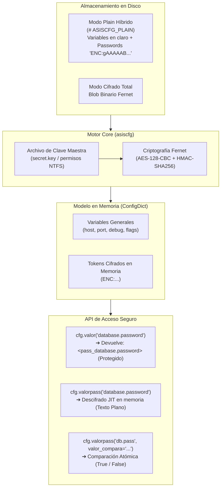

[🇪🇸 Español](README.md) | [🇺🇸 English](README.en.md)

---

# pkg-asiscfg

Librería modular y visor/editor gráfico (GUI) para la gestión centralizada, validación y cifrado seguro de archivos de configuración.

[](LICENSE)
[](https://www.python.org/downloads/)
[](https://cryptography.io/)

---

## 📋 Tabla de Contenidos

- [Características Principales](#-características-principales)
- [Nivel de Seguridad y Arquitectura Criptográfica](#-nivel-de-seguridad-y-arquitectura-criptográfica)
  - [1. Criptografía Robusta Estándar (Fernet / AES-128-CBC + HMAC-SHA256)](#1-criptografía-robusta-estándar-fernet--aes-128-cbc--hmac-sha256)
  - [2. Modelo de Cifrado Híbrido vs Total](#2-modelo-de-cifrado-híbrido-vs-total)
  - [3. Principio de Mínima Exposición (Lazy / Just-In-Time Decryption)](#3-principio-de-mínima-exposición-lazy--just-in-time-decryption)
  - [4. Comparación Segura de Contraseñas (In-Memory Safe Match)](#4-comparación-segura-de-contraseñas-in-memory-safe-match)
  - [5. Detección y Saneamiento Automático de Contraseñas en Texto Claro](#5-detección-y-saneamiento-automático-de-contraseñas-en-texto-claro)
  - [6. Control de Acceso, Hashing y Elevación de Privilegios (UAC)](#6-control-de-acceso-hashing-y-elevación-de-privilegios-uac)
  - [7. Auditoría Inmutable de Operaciones](#7-auditoría-inmutable-de-operaciones)
- [Arquitectura del Proyecto](#-arquitectura-del-proyecto)
- [Requisitos Previos](#-requisitos-previos)
- [Instalación y Configuración](#-instalación-y-configuración)
- [Modos de Uso](#-modos-de-uso)
  - [1. Interfaz Gráfica (GUI)](#1-interfaz-gráfica-gui)
  - [2. Uso como Librería Modular en Python](#2-uso-como-librería-modular-en-python)
  - [3. CLI y Parámetros Disponibles](#3-cli-y-parámetros-disponibles)
- [API de Acceso a Datos (`ConfigDict`)](#-api-de-acceso-a-datos-configdict)
  - [Tabla de Métodos de Acceso](#tabla-de-métodos-de-acceso)
  - [Herencia en Cascada (`valor_parent` / `valorpass_parent`)](#herencia-en-cascada-valor_parent--valorpass_parent)
  - [Gestión de Perfiles (`get_profiles`, `get_profile_config`)](#gestión-de-perfiles-get_profiles-get_profile_config)
- [Definición de Esquemas (`config_schema.py`)](#-definición-de-esquemas-config_schemapy)
  - [Esquema Estándar y Metadatos de Campo](#esquema-estándar-y-metadatos-de-campo)
  - [Soporte Multi-Perfil (`_template`)](#soporte-multi-perfil-_template)
  - [Botones de Prueba de Conexión (`test_connection`)](#botones-de-prueba-de-conexión-test_connection)
  - [Política de Respaldos Automáticos (`_backup`)](#política-de-respaldos-automáticos-_backup)
- [Compilación a Ejecutable Standalone (PyInstaller)](#-compilación-a-ejecutable-standalone-pyinstaller)
  - [Compilación 64-bit](#compilación-64-bit)
  - [Compilación 32-bit (Windows 7 / x86)](#compilación-32-bit-windows-7--x86)
- [Consideraciones Críticas de Seguridad y Operación](#-consideraciones-críticas-de-seguridad-y-operación)
- [Resolución de Problemas Frecuentes](#-resolución-de-problemas-frecuentes)
- [Autoría y Créditos](#-autoría-y-créditos)
- [Licencia](#-licencia)

---

## 🚀 Características Principales

- **Formatos de Almacenamiento Flexibles:**
  - **Modo Texto Plano Híbrido (`format_mode="plain"`, por defecto):** Guarda la configuración en formato JSON legible e identado con cabecera `# ASISCFG_PLAIN`, cifrando con Fernet **únicamente los campos sensibles** (`"is_password": True`) bajo el formato `"password": "ENC:gAAAAAB..."`. Permite inspeccionar y editar parámetros generales (puertos, IPs, nombres, flags) con cualquier editor de texto (Notepad, VS Code).
  - **Modo Cifrado Total (`format_mode="encrypted"`):** Cifra el archivo completo en un bloque binario seguro con Fernet (AES-128-CBC + HMAC-SHA256).
  - **Autodetección Inteligente de Formato:** `load_config()` detecta el formato de forma automática y transparente inspeccionando la firma del archivo o el binario Fernet, sin requerir parámetros adicionales.
  - **Nombres y Extensiones Arbitrarias:** Admite cualquier extensión (`config.enc`, `config.json`, `config.cfg`, etc.).
- **Modelo de Acceso Seguro a Datos (`ConfigDict`):**
  - **Enmascaramiento de Contraseñas:** `valor()` y `valor_profile()` devuelven una máscara protectora `<pass_seccion.clave>` para prevenir fugas accidentales en logs o trazas.
  - **Descifrado Just-In-Time (JIT):** `valorpass()` y `valorpass_profile()` descifran la credencial en memoria únicamente en el milisegundo exacto de su invocación.
  - **Comparación In-Memory sin Exposición:** `valorpass(..., valor_compara="pass")` valida contraseñas de forma atómica retornando un booleano (`True`/`False`), evitando asignar texto plano a variables intermedias.
  - **Herencia Jerárquica en Cascada:** `valor_parent()` y `valorpass_parent()` resuelven valores con prioridad Perfil (`@profiles.<id>.<sec>.<campo>`) ➔ Global (`<sec>.<campo>`) ➔ Default del esquema.
- **Interfaz Gráfica Moderna (CustomTkinter):**
  - **Indicador de Origen de Lectura:** Muestra en el encabezado si el archivo activo se leyó como `📄 Origen de lectura: Texto Plano (Editable)` o `🔒 Origen de lectura: Totalmente Encriptado`.
  - **Botones de Guardado Independientes:** Dos botones dedicados: `📄 Grabar Editable` (modo plain) y `🔒 Grabar Encriptado` (modo cifrado total).
  - **Validación Visual Estricta:** Validación en tiempo real de tipos numéricos, rangos (`min`/`max`), enumerados y campos obligatorios antes de permitir guardar.
  - **Prueba de Conexión Integrada (`test_connection`):** Botones configurables en el esquema para validar conectividad con bases de datos (SQL Server, PostgreSQL, MySQL, SQLite y tablas FoxPro/DBF) delegando en la librería externa `pkg-asisdb`.
  - **Gestión Multiperfil:** Alta, clonación, renombramiento, eliminación y personalización de perfiles con plantilla base `_template`.
  - **Visores Integrados:** Visores modales de la configuración activa en JSON y del esquema base interactivo.
- **Seguridad y Control de Acceso:**
  - Control de acceso administrativo protegido por hash SHA-256 (`admin_pass_hash`).
  - Validación de privilegios de Administrador (UAC en Windows) para modificaciones del sistema, con bypass `--dev` exclusivo para desarrollo.
  - Registro de auditoría trazable en `audit.log`.

---

## 🛡️ Nivel de Seguridad y Arquitectura Criptográfica

`pkg-asiscfg` ha sido diseñado siguiendo estándares de la industria para garantizar confidencialidad, integridad y no repudio en la gestión de credenciales y configuraciones de misión crítica.



### 1. Criptografía Robusta Estándar (Fernet / AES-128-CBC + HMAC-SHA256)
- La suite criptográfica utiliza la especificación **Fernet** de la librería estándar `cryptography`.
- **Confidencialidad:** Cifrado simétrico **AES con clave de 128 bits en modo CBC** con relleno PKCS7.
- **Integridad y Autenticidad:** Firma criptográfica **HMAC con SHA-256** calculada sobre el vector de inicialización (IV) y el texto cifrado. Esto previene ataques de manipulación (tampering) o modificación no autorizada: cualquier alteración de un solo bit en el token cifrado provocará el rechazo inmediato de la lectura.
- **Vector de Inicialización (IV) Único:** Cada operación de cifrado genera un IV aleatorio y un timestamp de 64 bits, garantizando que cifrar dos veces la misma contraseña genere tokens cifrados totalmente diferentes.

### 2. Modelo de Cifrado Híbrido vs Total
| Dimensión | Modo Plain Híbrido (`format_mode="plain"`) | Modo Cifrado Total (`format_mode="encrypted"`) |
| :--- | :--- | :--- |
| **Cabecera** | `# ASISCFG_PLAIN` | Encapsulado binario Fernet |
| **Variables Generales** | Texto JSON legible e identado | Cifradas en bloque binario |
| **Campos Sensibles** | Cifrados individualmente (`"password": "ENC:..."`) | Cifrados dentro del bloque |
| **Edición Externa** | Permite modificar IPs, puertos y flags con Notepad/VS Code sin alterar contraseñas | Requiere la GUI `asiscfg` o la librería en Python |
| **Seguridad de Claves** | **Idéntica (Fernet)** para todas las contraseñas | **Idéntica (Fernet)** para todo el archivo |

### 3. Principio de Mínima Exposición (Lazy / Just-In-Time Decryption)
Para prevenir la exposición accidental de contraseñas en trazas de error, dumps de memoria o registros de logging:
- Al cargar el archivo de configuración a memoria con `load_config()`, los campos marcados con `"is_password": True` **no se descifran masivamente**; se mantienen almacenados como tokens cifrados (`ENC:...`).
- Si un desarrollador llama accidentalmente a `cfg.valor("database.password")` o imprime `print(cfg.valor(...))`, la librería **nunca expone la contraseña** y devuelve la máscara `<pass_database.password>`.
- El descifrado se realiza **exclusivamente bajo demanda (Just-In-Time)** cuando la aplicación invoca `cfg.valorpass()` o `cfg.valorpass_profile()`.

### 4. Comparación Segura de Contraseñas (In-Memory Safe Match)
Cuando la aplicación necesita verificar si una clave ingresada por un usuario es correcta, no es necesario asignar la contraseña descifrada a una variable en texto plano:
```python
# Validación atómica sin retener texto plano en memoria:
es_valida = config.valorpass("database.password", valor_compara=input_usuario)
# Retorna True si coincide, False si no coincide
```

### 5. Detección y Saneamiento Automático de Contraseñas en Texto Claro
- Si un operador edita manualmente el archivo JSON e introduce una contraseña en texto claro (sin el prefijo `ENC:`):
  - En modo ejecución estándar, `asiscfg` detecta la anomalía de seguridad.
  - En modo interfaz gráfica (`edit_mode=True`), el método `cfg.get_unencrypted_passwords()` identifica las variables comprometidas y despliega un diálogo modal de advertencia (`PlaintextPasswordsWarningDialog`), forzando su cifrado automático con Fernet en el momento de guardar.

### 6. Control de Acceso, Hashing y Elevación de Privilegios (UAC)
- **Contraseña de Administración:** La clave para ingresar al configurador GUI se almacena en la sección `@asiscfg.admin_pass_hash` mediante un resumen criptográfico **SHA-256 unidireccional** (`hash_password()`).
- **Validación UAC de Windows:** Para evitar que usuarios locales sin privilegios modifiquen la configuración de servicios en producción, `is_admin()` valida los privilegios elevados del sistema operativo. La bandera `--dev` omite esta verificación únicamente para desarrollo y tests.

### 7. Auditoría Inmutable de Operaciones
- Todas las operaciones críticas (apertura del configurador, intentos de acceso, cambios de contraseña de administrador y eventos de guardado) se registran con marca de tiempo ISO en `audit.log`.

---

## 🏗 Arquitectura del Proyecto

```text
pkg-asiscfg/
├── asiscfg/                  # Paquete modular Python (pkg-asiscfg)
│   ├── __init__.py               # Fachada y exportación de API pública
│   ├── constants.py              # Rutas por defecto, firmas de versión y constantes
│   ├── core.py                   # Carga, guardado, cifrado híbrido, backup y esquemas
│   ├── crypto.py                 # Estrategias y motores criptográficos (Fernet, AES-GCM, ChaCha20)
│   ├── models.py                 # Modelo ConfigDict, métodos valor/valorpass y cascada
│   ├── schema.py                 # Validación de tipos, rangos numéricos y metadatos
│   ├── security.py               # Hashing SHA-256, validación UAC y auditoría
│   ├── resources/                # Recursos internos (idiomas y logo.ico)
│   └── ui/                       # Capa visual (CustomTkinter)
│       ├── app.py                # Ventana principal, pestañas dinámicas y validación UI
│       ├── dialogs.py            # Modales (login, cambio de clave, empresas, visor JSON)
│       └── utils.py              # Paletas, temas e iconos
├── resources/                    # Recursos raíz (iconos y logos de distribución)
├── tests/                        # Suite de pruebas unitarias automatizadas
│   ├── test_config_package.py    # Pruebas de esquemas, cifrado híbrido y multiempresa
│   ├── test_connection_mapping.py# Pruebas de mapeo de conexión y comodines
│   └── test_ui_profile_validation.py # Pruebas de validación estricta en UI y contraseñas
├── build_exe.py / .ps1           # Scripts de compilación PyInstaller 64-bit
├── build32.bat                   # Script de compilación PyInstaller 32-bit (Win7 / x86)
├── pyproject.toml                # Metadatos del paquete (name = "pkg-asiscfg")
├── requirements.txt              # Dependencias estándar de desarrollo
├── requi32.txt                   # Dependencias fijadas para entornos Win32
└── README.md                     # Documentación técnica completa
```

---

## 📦 Requisitos Previos

- **Python:** Versión `3.8` o superior (32-bit o 64-bit).
- **Sistema Operativo:** Windows 7 / 8 / 10 / 11 / Windows Server (o Linux para la capa core sin GUI).
- **Librerías Hermana:**
  - `pkg-i18n` (Internacionalización y traducciones)
  - `pkg-asisdb` (Conectividad y pruebas de base de datos)

---

## ⚙️ Instalación y Configuración

### 1. Clonar y Crear el Entorno Virtual

```powershell
# Ubicarse en el directorio del proyecto
cd "pkg-asiscfg"

# Crear el entorno virtual
python -m venv .venv

# Activar el entorno virtual
.\.venv\Scripts\Activate.ps1
```

### 2. Instalar Dependencias

```powershell
pip install -r requirements.txt
pip install -e .
```

---

## 🖥 Modos de Uso

### 1. Interfaz Gráfica (GUI)

Para abrir la herramienta de configuración con la interfaz visual en modo desarrollo:

```powershell
python asiscfg.py --schema-file "..\PATH_TO_SCHEMA\config_schema.py" --config-file "..\PATH_TO_CONFIG\config.cfg" --key-file "..\PATH_TO_KEY\config.key" --dev --app
```

#### Flujo de autenticación en la GUI:
1. Al iniciar por primera vez sobre un archivo sin contraseña configurada, la clave por defecto es: `admin`.
2. Para entornos de producción (sin la bandera `--dev`), la herramienta requerirá ejecutarse como **Administrador** (elevación UAC de Windows).
3. **Indicador de origen:** En el encabezado superior observará si el archivo se abrió como texto plano editable o cifrado total.
4. **Guardado:** Dispone de los botones `📄 Grabar Editable` (modo plain híbrido) y `🔒 Grabar Encriptado` (modo cifrado total).

---

### 2. Uso como Librería Modular en Python

```python
from asiscfg import load_config, save_config

# 1. Cargar la configuración (detecta automáticamente si es plain o encrypted)
config = load_config(
    config_path="config.cfg",
    key_path="config.key"
)

# Conocer el formato de origen detectado ('plain' o 'encrypted')
print("Formato de origen:", config.format_mode)

# 2. Acceso a parámetros generales (No sensibles)
app_name = config.valor("app.name", default="Mi Aplicacion")
db_host = config.valor("database.host", default="127.0.0.1")
db_port = config.valor("database.port", default=1433)

# 3. Acceso a contraseñas (Seguridad JIT)
# NOTA: config.valor("database.password") retornaría "<pass_database.password>"
db_pass = config.valorpass("database.password")

# 4. Comparación atómica de contraseña sin exponer texto claro
es_correcta = config.valorpass("database.password", valor_compara="secreto123")

# 5. Acceso a configuraciones de perfil (@profiles)
perfil_activo = "01"
emp_name = config.valor_profile(perfil_activo, "info.name")
emp_pass = config.valorpass_profile(perfil_activo, "database.password")

# 6. Herencia en Cascada: Perfil -> Global -> Default
host_efectivo = config.valor_parent("database.host", profile_code=perfil_activo)
pass_efectivo = config.valorpass_parent("database.password", profile_code=perfil_activo)

# 7. Modificar valores y guardar
config["database"]["host"] = "192.168.1.50"

# Guardar en modo texto plano editable con claves cifradas (por defecto):
save_config("config.cfg", "config.key", dict(config), format_mode="plain")

# O guardar en modo totalmente encriptado:
save_config("config.cfg", "config.key", dict(config), format_mode="encrypted")
```

---

### 3. CLI y Parámetros Disponibles

El comando `python asiscfg.py` admite las siguientes opciones:

| Parámetro | Tipo | Descripción |
| :--- | :--- | :--- |
| `--config-file` | `Ruta` | Ruta al archivo de configuración (por defecto: `config.enc`, admite cualquier extensión como `.json`, `.cfg`, etc.). |
| `--key-file` | `Ruta` | Ruta al archivo de clave maestra Fernet (por defecto: `secret.key`). |
| `--schema-file` | `Ruta` | Ruta al archivo `.py` que define `DEFAULT_CONFIG` / esquema. |
| `--format-mode` | `String` | Modo de guardado para operaciones CLI: `'plain'` (por defecto) o `'encrypted'`. |
| `--theme` | `String` | Modo de apariencia visual: `'dark'` (por defecto), `'light'` o `'system'`. |
| `--dev` | `Flag` | **Modo desarrollo:** Omite la validación obligatoria de privilegios de Administrador (UAC). |
| `--app` | `Flag` | Permite la edición en la interfaz de los parámetros de la sección `app`. |
| `--reset-admin-pass` | `Flag` | Restablece la contraseña de administración a `'admin'` directamente vía CLI sin abrir la GUI. |
| `--export-schema` | `Flag` | Exporta la plantilla base `config_schema.py` en la ruta especificada. |
| `--i18n-path` | `Ruta` | Directorio de traducciones externas del proyecto anfitrión. |

---

## 📊 API de Acceso a Datos (`ConfigDict`)

La clase `ConfigDict` hereda de `dict` e incorpora métodos especializados de seguridad y resolución jerárquica:

### Tabla de Métodos de Acceso

| Método | Tipo de Campo | Comportamiento |
| :--- | :--- | :--- |
| `valor(key_path, default=None)` | No-Password | Retorna el valor en texto claro. |
| `valor(key_path, default=None)` | Password (`is_password: True`) | Retorna la máscara `<pass_{key_path}>`. |
| `valorpass(key_path, default="", valor_compara=None)` | Password (`is_password: True`) | Si `valor_compara` es `None`, descifra JIT y retorna el texto claro. Si se pasa `valor_compara`, retorna booleano (`True`/`False`). |
| `valorpass(key_path, default="", valor_compara=None)` | No-Password | Retorna la máscara `<var_{key_path}>`. |
| `valor_profile(profile, key_path, default=None)` | No-Password / Password | Mismo comportamiento que `valor()`, contextualizado al perfil en `@profiles.<profile>`. |
| `valorpass_profile(profile, key_path, ...)` | No-Password / Password | Mismo comportamiento que `valorpass()`, contextualizado al perfil en `@profiles.<profile>`. |
| `valor_parent(key_path, profile="", default="", key_path_parent="")` | No-Password / Password | Resuelve en cascada: Perfil ➔ Global ➔ Default. Enmascara campos de contraseña. |
| `valorpass_parent(key_path, profile="", default="", key_path_parent="", ...)` | No-Password / Password | Resuelve en cascada y descifra JIT campos de contraseña. |

### Gestión de Perfiles
- `cfg.get_profiles()`: Retorna la lista de códigos de perfil registrados bajo `@profiles` (ej. `["01", "02"]`).
- `cfg.has_profiles()`: Retorna `True` si existen perfiles configurados.
- `cfg.get_profile_config(profile_code)`: Retorna el diccionario completo del perfil solicitado.
- `cfg.get_unencrypted_passwords()`: Retorna la lista de tuplas `(campo, valor)` de contraseñas detectadas sin cifrar al cargar.

---

## 📝 Definición de Esquemas (`config_schema.py`)

### Esquema Estándar y Metadatos de Campo

```python
DEFAULT_CONFIG = {
    "app": {
        "name": {"default": "ASISNET CONFIGURADOR", "type": "str", "description": "t18n#Nombre de la aplicación"},
        "version": {"default": "1.0.0", "type": "str", "description": "t18n#Versión del sistema"}
    },
    "database": {
        "engine": {
            "default": "mssql",
            "type": "enum",
            "options": ["mssql", "postgresql", "mysql", "sqlite", "foxpro"],
            "description": "t18n#Motor de base de datos"
        },
        "host": {"default": "127.0.0.1", "type": "str", "description": "t18n#Servidor o Host"},
        "port": {"default": 1433, "type": "int", "min": 1, "max": 65535, "description": "t18n#Puerto TCP"},
        "user": {"default": "sa", "type": "str", "description": "t18n#Usuario de BD"},
        "password": {"default": "", "type": "str", "is_password": True, "description": "t18n#Contraseña de BD"}
    }
}
```

> [!TIP]
> **Internacionalización con prefijo `t18n#`:**
> Al prefijar la descripción con `t18n#` (ej. `"description": "t18n#Nombre de la aplicación"`), `asiscfg` traduce automáticamente el texto al idioma activo usando `pkg-i18n`.

---

### Soporte Multi-Perfil (`_template`)

```python
DEFAULT_CONFIG = {
    "general": {
        "host": {"default": "192.168.1.100", "description": "Servidor Principal"},
        "user": {"default": "sa", "description": "Usuario"}
    },
    "@profiles": {
        "_template": {
            "conexiones": {
                "database": {"default": "DAT[empresa_destino]SRVSQL", "description": "Base de datos"},
                "btn_probar": {
                    "type": "test_connection",
                    "description": "🔌 Probar Conexión",
                    "mapping": {
                        "driver": "conexiones.driver",
                        "host": ["conexiones.host", "general.host"],
                        "database": "conexiones.database",
                        "user": ["conexiones.user", "general.user"],
                        "password": ["conexiones.password", "general.password"],
                        "empresa_destino": "info.empresa_destino"
                    }
                }
            }
        },
        "01": {
            "conexiones": {
                "database": "DAT01SRVSQL"
            }
        }
    }
}
```

---

### Botones de Prueba de Conexión (`test_connection`)

Permiten ejecutar pruebas de conectividad directamente desde la interfaz mediante `"type": "test_connection"` y un `"mapping"` de parámetros:
- **Prioridad en cascada:** `["campo_local", "general.campo_global", LITERAL("mssql")]`.
- **Comodines dinámicos:** Interpolación automática de `[empresa_destino]`, `[empresa_origen]`, `{TIMESTAMP}`, etc.
- **Aislamiento:** Los botones se definen únicamente donde aplican y nunca se persisten en el archivo final de configuración.

---

### Política de Respaldos Automáticos (`_backup`)

```python
DEFAULT_CONFIG = {
    "_backup": {
        "enabled": True,                           # Activar/desactivar respaldos automáticos
        "method": "timestamp",                     # "timestamp" (fechado rotativo), "simple" (.bak fijo), "none"
        "target_dir": "{ROOT}/backups",            # Ruta fija con {ROOT} o clave puente: SCHEMA_KEY("paths.path_backup")
        "filename_pattern": "{TIMESTAMP} - {BASENAME}{EXT}.bak",  # Patrón de nombrado con comodines
        "max_backups": 20                          # Límite de retención histórica (0 = ilimitado)
    }
}
```

---

## 📦 Compilación a Ejecutable Standalone (PyInstaller)

### Compilación 64-bit:
```powershell
python .\build_exe.py
```
*(O ejecutando `.\build_exe.ps1`)*.

### Compilación 32-bit (Windows 7 / x86):
Para compilar en entornos Windows de 32 bits (Python 3.8 x86):
1. Instalar las dependencias de [requi32.txt](file:///requi32.txt):
   ```cmd
   pip install -r requi32.txt
   ```
2. Ejecutar el script batch de compilación:
   ```cmd
   build32.bat
   ```

El ejecutable resultante se genera en `dist/asiscfg/asiscfg.exe`.

---

## 🔒 Consideraciones Críticas de Seguridad y Operación

> [!WARNING]
> **Gestión de la Clave Maestra (`secret.key` / `config.key`):**
> 1. Contiene la clave criptográfica Fernet necesaria para descifrar la configuración o los campos individuales `ENC:...`.
> 2. **NUNCA** suba archivos de clave a repositorios de código públicos o de control de versiones.
> 3. Si se extravía o borra, las contraseñas y configuraciones cifradas **no se podrán recuperar** sin un respaldo previo en bóveda institucional.
> 4. En entornos de producción, asigne permisos NTFS de solo lectura para el usuario de servicio correspondiente.
> 5. Para consultar el procedimiento de respaldo y contingencia, revise la [Guía de Seguridad y Recuperación de Claves](docs/SECURITY.md).

---

## ❓ Resolución de Problemas Frecuentes

### 1. `RuntimeError: [ERROR] customtkinter no está instalado en este entorno`
- **Causa:** El script se ejecutó con el intérprete global de Python o el entorno virtual no está activo.
- **Solución:** Active el entorno virtual antes de ejecutar:
  ```powershell
  .\.venv\Scripts\Activate.ps1
  python asiscfg.py
  ```

### 2. Mensaje de error de permisos de Administrador (UAC)
- **Causa:** En modo producción la herramienta requiere privilegios elevados.
- **Solución:** Ejecute PowerShell como Administrador o añada `--dev` para desarrollo.

### 3. Olvido de contraseña de Administrador
- **Solución:** Ejecute el comando CLI para restablecer la contraseña al valor por defecto (`admin`):
  ```powershell
  python asiscfg.py --reset-admin-pass
  ```

---

## 👥 Autoría y Créditos

* **Autor:** [Boris Pinto](https://github.com/borispinto) (`borispinto@asisnet.net`)
* **Mantenedor:** [Asisnet Computacion, CA](https://www.asisnet.net) (`proyectos@asisnet.net` / `soporte@asisnet.net`)
* **Repositorio Oficial:** [github.com/borispinto/pkg-asiscfg](https://github.com/borispinto/pkg-asiscfg)

---

## 📄 Licencia

Este proyecto está bajo la Licencia **MIT** - consulte el archivo [LICENSE](LICENSE) para más detalles.

Copyright (c) 2026 Asisnet Computación, CA & Boris Pinto.
