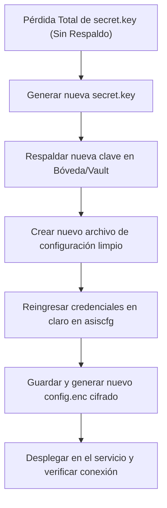

# 🔒 Guía de Seguridad y Gestión de Claves (`secret.key`)

Este documento detalla el modelo de seguridad criptográfico, las políticas de resguardo y los procedimientos operativos para el respaldo, recuperación y contingencia de la clave maestra (`secret.key`) utilizada por **`asiscfg`** y sus aplicaciones asociadas.

---

## 1. Modelo Criptográfico y Principios

`asiscfg` implementa la especificación criptográfica **Fernet** (de la librería `cryptography` de Python), la cual proporciona cifrado simétrico autenticado:
- **Cifrado:** AES-128 en modo CBC con clave derivada.
- **Autenticación e Integridad:** HMAC con SHA-256 para verificar que el contenido no haya sido manipulado.
- **Formato de Clave (`secret.key`):** Clave de 256 bits codificada en Base64 URL-safe (32 bytes crudos codificados en 44 caracteres).

> [!WARNING]
> **Irreversibilidad Matemática:**
> Dado que se trata de cifrado simétrico robusto, **no existe ningún método matemático o de fuerza bruta viable para recuperar o descifrar `config.enc` si se extravía el archivo `secret.key` correspondiente**. Toda recuperación depende exclusivamente de las copias de seguridad autorizadas.

---

## 2. Políticas de Resguardo y Buenas Prácticas

1. **Aislamiento en Repositorios:**
   - El archivo `secret.key` **nunca** debe incluirse en commits ni subirse a repositorios de código (Git).
   - Asegúrese de que `secret.key` y `*.enc` estén listados en el archivo `.gitignore`.

2. **Almacenamiento Seguro Corporativo:**
   - La clave maestra de cada ambiente (desarrollo, testing, producción) debe quedar registrada en la bóveda o gestor de contraseñas institucional (ej. *KeePass, Bitwarden corporativo, Azure Key Vault, HashiCorp Vault*).
   - Solo el personal de infraestructura/seguridad y administradores autorizados deben tener acceso al secreto.

3. **Permisos a Nivel de Sistema Operativo (Windows NTFS):**
   - El archivo `secret.key` en el servidor o cliente de despliegue debe contar con permisos NTFS restrictivos:
     - **Lectura:** Exclusivamente para el usuario o cuenta de servicio bajo la cual se ejecuta el aplicativo.
     - **Denegar acceso:** A usuarios estándar sin privilegios administrativos.

---

## 3. Procedimiento Operativo de Recuperación (Desde Respaldo)

Si el archivo `secret.key` se elimina o se corrompe en el entorno local pero existe una copia en la bóveda corporativa:

### Paso 1: Obtener la copia autorizada
Localice la entrada correspondiente al ambiente/cliente en la bóveda institucional de contraseñas y copie el contenido de la clave (44 caracteres Base64).

### Paso 2: Restaurar el archivo `secret.key`
Cree o reemplace el archivo `secret.key` en la ruta esperada por la aplicación o ejecute el siguiente comando en PowerShell:

```powershell
Set-Content -Path ".\secret.key" -Value "PEGAR_AQUI_LA_CLAVE_BASE64_DEL_VAULT" -NoNewline -Encoding Ascii
```

### Paso 3: Ajustar Permisos NTFS
Asegúrese de que los permisos de lectura sean asignados a la cuenta de servicio:
```powershell
icacls ".\secret.key" /inheritance:r /grant:r "SYSTEM:(R)" "Administrators:(F)"
```

### Paso 4: Validar la Lectura con `asiscfg`
Ejecute la herramienta para comprobar que el archivo `config.enc` puede descifrarse y abrirse correctamente sin errores criptográficos (`InvalidToken`):
```powershell
python .\asiscfg.py --schema-file "ruta\a\config_schema.py" --config-file "ruta\a\config.enc" --key-file ".\secret.key" --dev --app
```

---

## 4. Plan de Contingencia ante Pérdida Total (Regeneración)

Si el archivo `secret.key` se perdió por completo y **no existe copia de respaldo**, el archivo `config.enc` anterior es inservible. Debe ejecutarse el siguiente plan de contingencia para restablecer el servicio:



### Paso 1: Generar una nueva clave Fernet
Genere un nuevo archivo `secret.key` mediante Python o PowerShell:

**Opción A (Python):**
```powershell
python -c "from cryptography.fernet import Fernet; open('secret.key', 'wb').write(Fernet.generate_key())"
```

**Opción B (PowerShell nativo):**
```powershell
$bytes = New-Object byte[] 32
[System.Security.Cryptography.RandomNumberGenerator]::Create().GetBytes($bytes)
$key = [Convert]::ToBase64String($bytes).Replace('+','-').Replace('/','_')
[IO.File]::WriteAllText("secret.key", $key, [System.Text.Encoding]::ASCII)
```

### Paso 2: Respaldar inmediatamente en la Bóveda Institucional
Antes de continuar, copie el nuevo contenido de `secret.key` y regístrelo en el gestor de secretos corporativo.

### Paso 3: Reconfigurar credenciales con `asiscfg`
Abra `asiscfg` apuntando a un nuevo archivo `config.enc` y a la nueva `secret.key`:
```powershell
python .\asiscfg.py --schema-file "ruta\a\config_schema.py" --config-file ".\config.enc" --key-file ".\secret.key" --dev --app
```
1. Ingrese los valores requeridos para cada sección (cadenas de conexión a BD, contraseñas, tokens de API).
2. Haga clic en **Guardar Configuración** (o *Save*).
3. Verifique que `config.enc` se haya generado cifrado con la nueva clave.

---

## 5. Rotación Periódica de Claves

Para rotar una clave `secret.key` existente de forma planificada:
1. Abra la configuración actual con la clave activa y guarde una copia temporal en modo plano (`format_mode="plain"`) en un medio volátil/seguro, o mantenga abierta la interfaz de `asiscfg`.
2. Genere la nueva `secret.key`.
3. Guarde la configuración utilizando la nueva clave.
4. Actualice la clave en la bóveda corporativa y en todos los servicios dependientes.
5. Elimine de forma segura cualquier copia no cifrada temporal.
